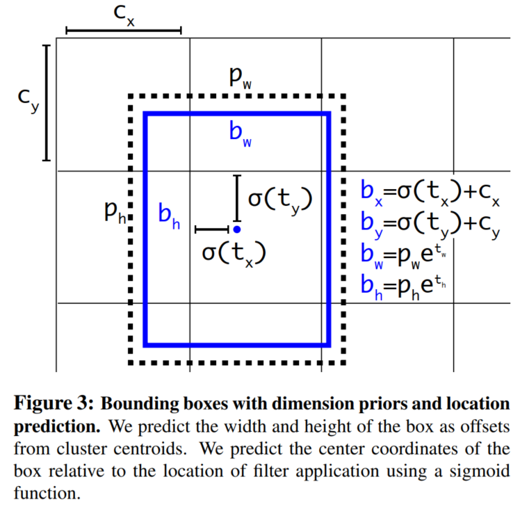
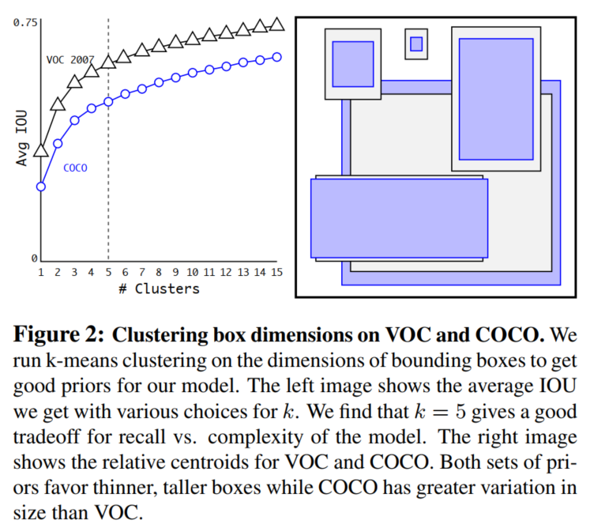
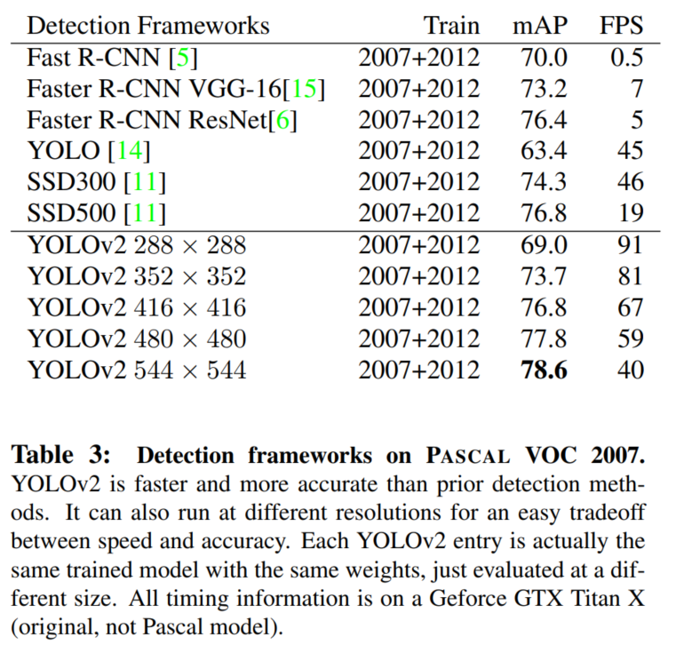

## YOLO9000: Better, Faster, Stronger
阅读笔记 by **luo13**

### 网络结构 #TODO

### 模型优点
1. **模型更加容易收敛**
   使用了Batch Normalization，每一个卷积后面加上BN，并且不用使用dropout
   使用Anchor策略并对Anchor加以约束，并提高了定位精度以及召回率
2. **使用聚类方式找出较为常见的物体长宽比，增加每个grid的预测框数量**
   聚类方式使用K-Means方法，论文中使用了五个较为常见的长宽比，也就是每个grid也需要预测五个预测框
3. **对于多尺度的适应性更好**
   论文方法中，每过几个batch就会更换输入图片的尺寸，区间是[320, 608]，stride=32
4. **使用了Darknet速度上有所提升** #TODO
5. **检测的类别更多** #TODO

### 模型缺点 #TODO

### 损失函数
与YOLO_v1一样

### 实验细节 #TODO
**Anchor策略**

&emsp;$\begin{cases}
{x=({t_x*w_a})-x_a}\\
{y=({t_y*h_a})-y_a}
\end{cases}$
&emsp;这里介绍了将锚点机制加入到YOLO之后的相对位移${t_x,t_y}$的计算公式，**个人感觉应该是+，而不是-**
&emsp;故，这里改为
&emsp;$\begin{cases}
{x=({t_x*w_a})+x_a}\\
{y=({t_y*h_a})+y_a}
\end{cases}$
&nbsp;
&emsp;$\begin{cases}
{b_x=\sigma(t_x)+c_x}\\
{b_y=\sigma(t_y)+c_y}\\
{b_w=p_we^{t_w}}\\
{b_h=p_he^{t_h}}\\
{Pr(object)*IOU(b,object)=\sigma(t_o)}
\end{cases}$
&nbsp;
&emsp;其中，${t_x,t_y,t_w,t_h,t_o}$是YOLO_v2的预测值
&emsp;${c_x,c_y}$是grid cell的左端点
&emsp;${p_w,p_h}$是anchor的宽和高
&emsp;${c_x,c_y}$使用grid cell大小进行归一化，如${c_x=x_{anchor}/W_{gridcell}}$
&emsp;${p_w,p_h}$使用图像大小进行归一化，如${p_w=W_{anchor}/W_{image}}$
&emsp;${b_x,b_y,b_w,b_h}$是预测框的左上端点坐标以及宽和高
&nbsp;
&emsp;YOLO_v2的预测值是${t_x,t_y,t_w,t_h,t_o}$，可以推测
&emsp;$\begin{cases}
{t_x=(x-x_a)/w_a}\\
{t_y=(y-y_a)/h_a}
\end{cases}$
&emsp;**${x, y}$是预测框左上角端点的实际坐标**,所以${\sigma(t_x),\sigma(t_y)}$会被归一化到[0, 1]，即坐标偏移量被限制在一个grid cell中。
&emsp;$\begin{cases}
{t_w=log(w/p_w)}\\
{t_h=log(h/p_h)}
\end{cases}$
&emsp;**${w, h}$是预测框的实际宽高**

**Clustering策略**

### 性能指标

### 疑问
