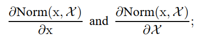
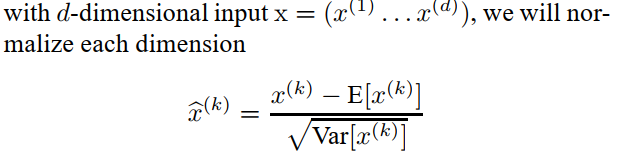
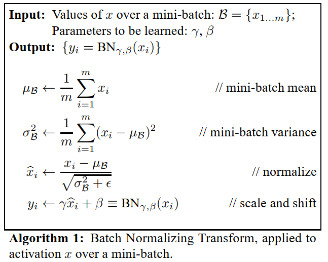
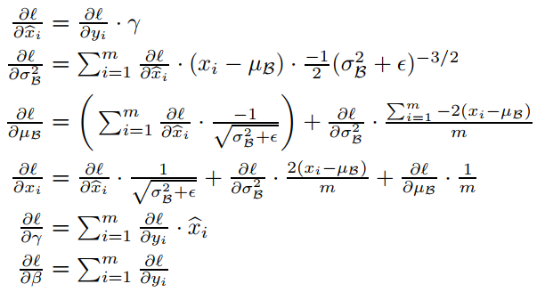
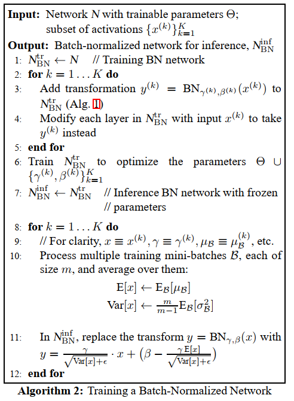

## Batch Normalization: Accelerating Deep Network Training by Reducing Internal Covariate Shift
阅读笔记 by **luo13**  

**总结**  
作者认为深层神经网络难以收敛是因为每次更新参数之后每层网络输出的分布都会发生改变，神经网络除了再调整参数还得重新学习输出的分布。如果使每层神经网络的输出分布保持大致的一致。从而让训练收敛更快。  

**Batch Normalization**  
输出的分布不仅与当前输入有关系，还与整个数据集的有关系（因为参数更新依赖于整个数据集），所以要归一化输出，则需要计算以下的雅可比矩阵。  
  
但是这样进行归一化，在反向传播的时候代价是非常大的（具体计算没弄懂，想象一下，计算整个数据集的方差和均值本身就是计算损耗比较大的）  

为了解决这一问题，作者提出了两个简化的方法  
第一，不归一化整个输出或输入，而是归一化单独的特征维度，如果输入是图像的话，可以对channel维度进行归一化（也就是对NWH标准化）。  
   

第二，归一化不使用整个数据集，训练时使用mini-batch的均值和方差，推理的时候再将所由mini-batch的均值和方差都做平均得到全局的均值和方差。（实际应用中通常不会记录所有mini-batch的均值和方法，而是使用滑动平均的方法。）  

除此之外，为了防止因为归一化而丢失掉学习到的特征（比如说，如果都进行归一化，会使输入的分布和输出的分布完全一样，都是均值为0，方差为1），所以增加了两个可学习的参数，对归一化之后的数据进行线性变换。  
  

**Batch Normalization是可以进行反向传播的**  
  

**训练和推理**  
  
