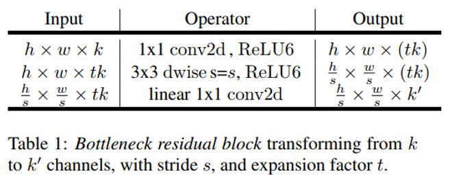
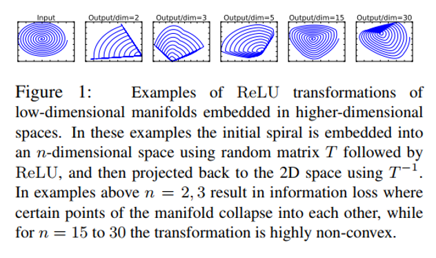

## Batch Normalization: Accelerating Deep Network Training by Reducing Internal Covariate Shift
阅读笔记 by **luo13**  
2020-3-3  

MobileNetV2的出现过程其实是一个回顾-》分析-》尝试的过程，首先他对MobileNetV1进行了回顾，发现V1训练出来的很多参数都是接近于0的，基于这个问题，作者提出了两种假设，一个是输入特征太少了，导致分离卷积学习不到内容；第二个是作者认为有非线性的操作会使信息丢失。针对第一个问题，作者在每个block前面都通过1x1的卷积将输入的通道数增加，因为可分离卷积的计算量比较小，这就保证了增加信息的同时不会增加太多的计算量，同时采用了类似残差模块的结构增加模型反向传播和学习特征的能力。  

**残差模块结构**  
这里的ReLu6指的是ReLu的最大输出值是6，这样设置是为了训练时就拟合移动设备的低精度float16。而这里不像通常的残差模块那样先降为再升维，而是先升维再将维，可分离卷积的计算量比较少，所以可以这样做，增加输入的信息。  
  

**低维映射应该使用线性变换**  
第二个是作者通过针对性的实验，发现经过ReLu之后会丢失信息，且低维特征丢失比高维特征更加明显，所以作者在残差模块的低维变换部分将ReLu改成了线性激活函数。对文中说到的流行（maniflod）不是很清楚，但应该是输出维度越低，信息丢失就会越严重。网上有人说在Xception里面已经做过实验残差模块最后一个relu会影响性能，但个人感觉应该还是不一样的，通常的卷积模块是先窄后宽。  
  

小结：总结很重要，发现问题之后也得从正确的角度去实践自己的想法。
