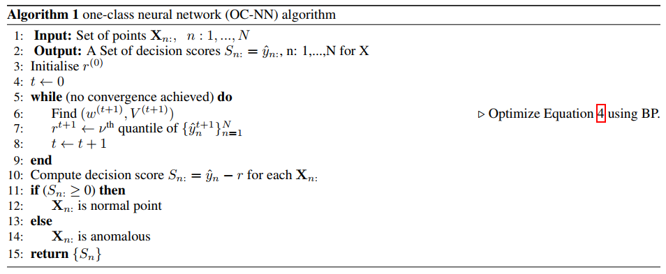

## ANOMALY DETECTION USING ONE-CLASS NEURAL NETWORKS
阅读笔记 by **luo13**  
2020-5-10  

这篇文章的方法与DSVDD是一致的，只是没有用超球面设置，而是用超平面将正常数据与原点数据分离开来。（这一思想应该是从最早的one-class SVM延续而来的，直观上不太理解为什么可以这样，毕竟除了原点区域还有很多区域）

  
这里的r指的是超平面的偏置，在目标函数里面加上r，目的是使超平面与原点之间的距离至少是(1/2)r。这与DSVDD论文里面写的又不太一样，DSVDD里面说的r是超平面到原点的距离。

  
文章里面没有说r的初始值如何确定，w的初始值也没说怎么确定，但是给了源码。算法首先是先固定r，然后求解离原点最大的一个超平面，然后固定w和网络参数，求解一个能使结果最小的r，这里是结果最小的r其实是允许误差范围（Nv）里面最大的r。从而实现找到一个离原点距离最大的超平面，使大部分的正常数据落在超平面外面。

正常的SVM应该是不包含-r那一项的，但如果分开优化的话，的确是前一步最优时取得最大间隔，后一步固定w和网络参数后，也是在允许误差的边界上取得最优值。

网络结构与DSVDD基本一致，只是这里训练第二步的时候冻结了encoder部分的参数。这里的特征表达的学习也是很重要的，或许可以在autoencoder上面多做文章。  

  

疑惑：这个损失函数能保证一定大于0吗？而且为什么说原点数据就代表异常数据呢？
