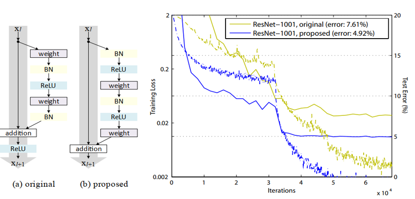
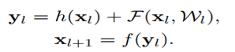
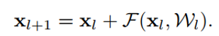
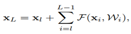
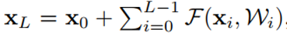
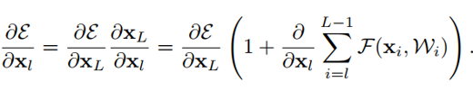

## Identity Mappings in Deep Residual Networks
阅读笔记 by **luo13**  
2020-3-3  

ResNetV2主要是对ResNetV1的残差模块进行了调整，而且给出了相应的理论推导。  

  
  

左边是V1，右边是V2。至于为什么这样修改，作者给出了相应的理论推导。  

   
   
   
   
   

从最后的偏导可以看出，xl的偏导取决于两个部分，第一个部分的导数与参数无关，保证了有一部分的梯度可以传到任意的参数上，第二部分则是考虑到了网络参数。同时作者认为，在使用mini-batch的时候不会导致梯度消失，以为第二部分的导数不太可能等于1。综合上述的内容，当X_l+1 = y_l的时候，即addition之后不要有任何的操作，会有利于反向传播的进行。所以本文将f改成了单元映射，而BN要放在前面的原因是这样的实验结果更好。作者还尝试了其他的结构（b-d），左后的残差模块是(e)图所呈现的结构。  

小结：虽然深度学习方面很多新的论文都是灵感上的创新，很多顶会上的论文更多是从实验上去证明自己的创新的有效性，但如果能想到理论上的创新，目的性会更强，效果也会比较好。有灵感最后最好先想想理论支持，如果真的能在理论上找到支持，成功的概率会大很多。  
