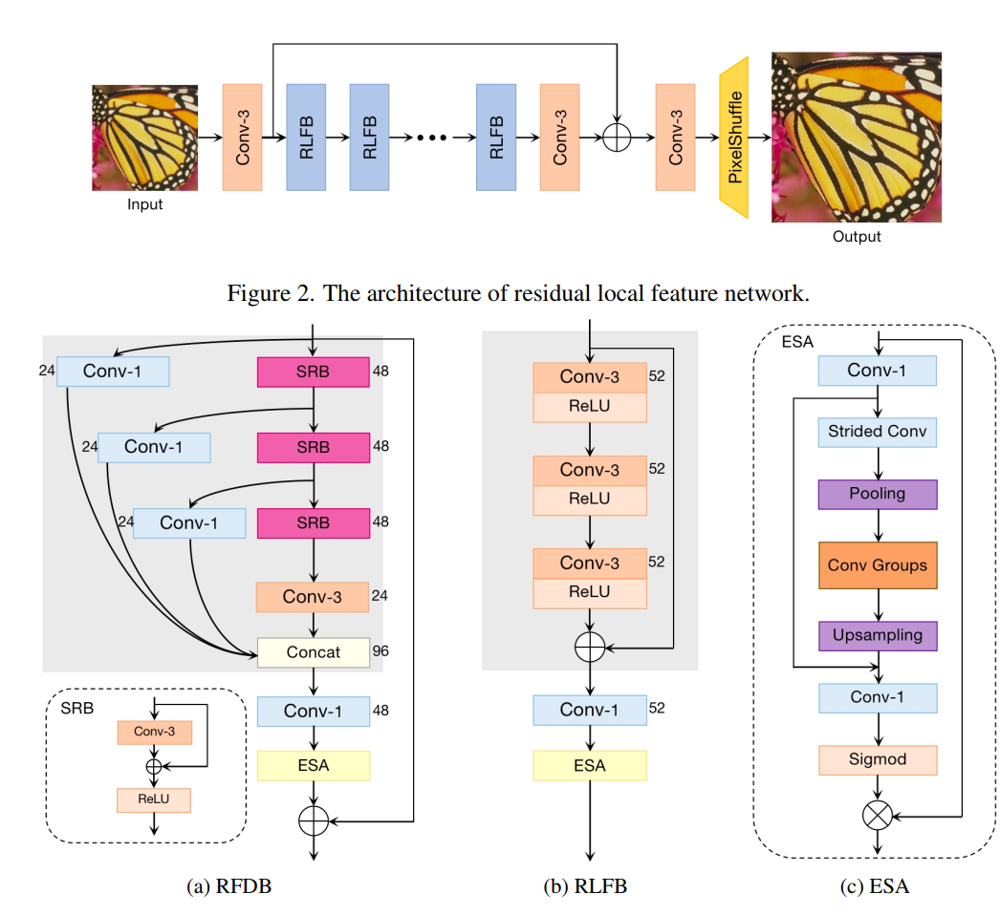
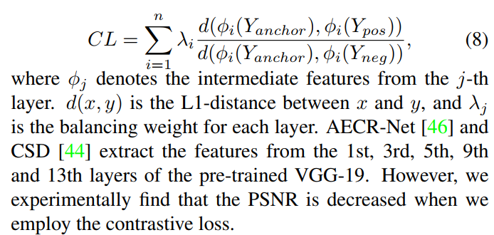
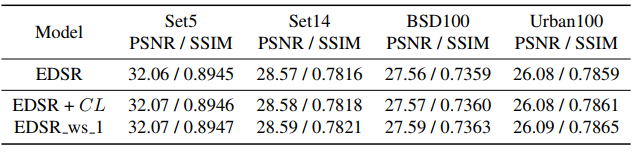

## Residual Local Feature Network for Efficient Super-Resolution

全文一共三个改进：  
1、网络结构上的改进  
2、loss的改进  
3、训练策略的改进  

### 网络结构  
作者以RFDB为基准模型，发现将其蒸馏部分的1x1卷积去除后，能保证性能的情况下大幅度减少推理时长，且利用了一个剪枝分析工具，分析出conv groups的卷积最耗时，并将其卷积数量减少为1个。  
   

### loss上的改进  
加入了对比损失，但发现直接使用VGG19作为比较模型效果不好，然后初始化了一个很简单的两层的特征网络进行特征提取，不知道为什么不训练效果也挺好的，模型结构为Conv k3s1-Tanh-Conv k3s1。  
   

### 训练策略的改进  
看起来就像是多次训练  

看实验结果，CL Loss和训练策略带来的提升并不是很大  
   
