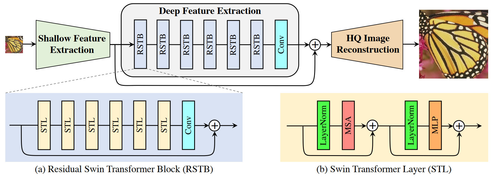
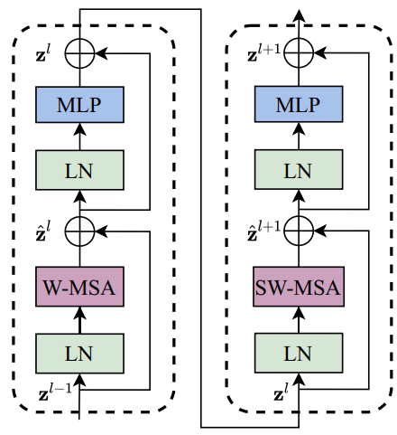

### SwinIR: Image Restoration Using Swin Transformer

这篇文章适用于超分、去噪、图片压缩等任务  

SwinIR一共由三个部分组成：浅层特征提取模块、深层特征提取模块以及高质量重建模块  

浅层特征提取模块由少量的卷积层组成，高质量重建模块也是基于CNN构建的  

   
   

文中STL是基于SwinIR Transformer的结构  

主要的难点还是Swin Transformer的结构，后续会写一篇笔记  
