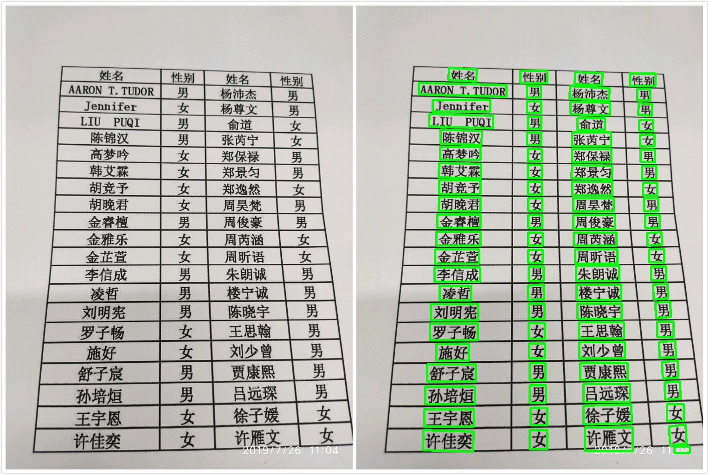
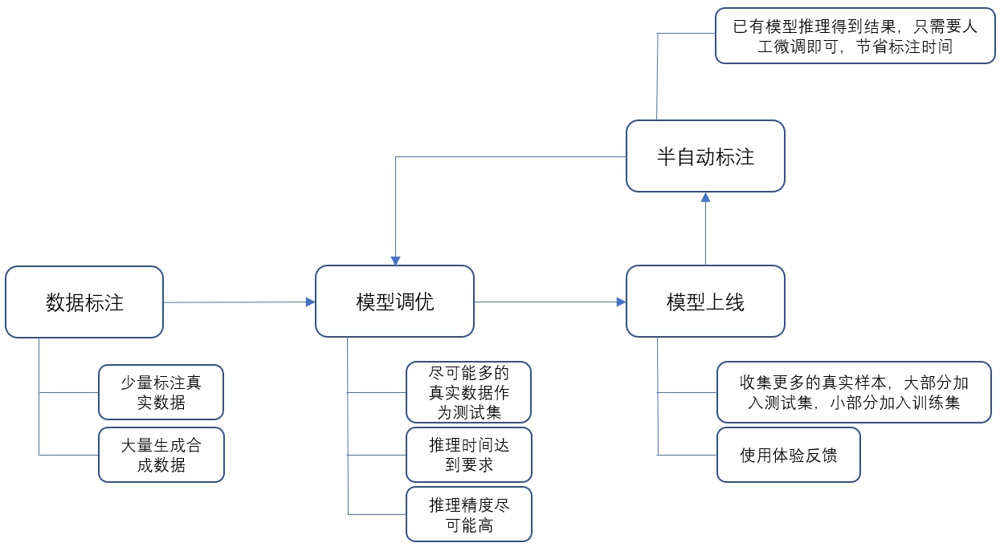
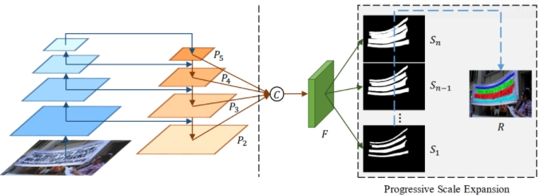
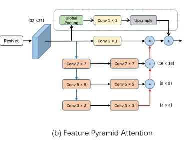
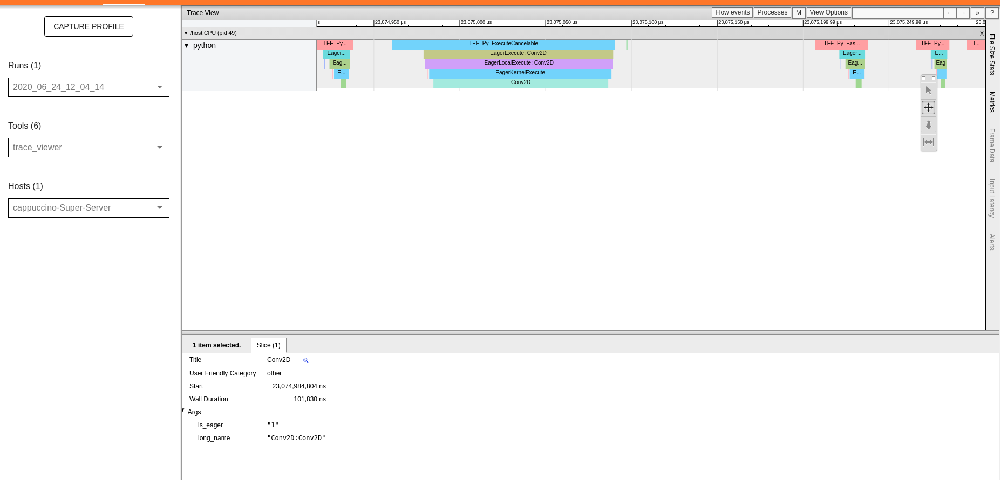

### 实习内容  
1. 负责身份证检测识别系统中的文字检测部分  
2. 负责班级优化大师中的花名册检测识别系统中的文字检测部分  
  

### 工作介绍  
上述实习内容的两个部分在实习最后都整理成了相同的系统，故只对其中一个进行介绍。总的来说，在实习过程中主要负责的是图片中的印刷文字检测（图片来自各种拍摄场景或者屏幕截图、手机截图）。  

  

### 工作难点  
1. 缺少真实数据  
2. 文本较为密集，容易产生文本粘连的情况  
3. 实时性要求比较高  
4. 数据标注耗时  

### 功能实现  

* 缺少真实数据  

接手任务的时候，并没有太多的真实数据，采用了少量标注真实数据+大量模拟合成数据的方式组成训练集，测试集采用的是真实数据，保证模型训练结果的可靠性，因为真实数据较少，所以整个算法流程只使用了训练集和测试集，并没有采用验证集。  

* 模型调优  

在模型上线之前，模型的精度和速度都需要达到设定的要求。  

精度方面：现有测试集上，H1得分（iou=0.7情况下）达到0.7以上。  
速度方面：在i5-4核的配置下达到单张图片推理速度需要达到100ms。  

**精度优化**：为了能在较为简单的情况下获取更多的文本信息（角度、位置、面积等），在项目实现过程中采用了图像分割的方法，而没有使用目标检测的方式。在上述任务文本检测中，通常文字都是密集的，**这种密集的文本在分割过程中容易发生粘连**。为了解决这一问题，当时使用Tensorflow复现了[PSENet](https://arxiv.org/pdf/1806.02559.pdf)，这一方法通过预测不同大小的文本区域，并且从最小概率发生粘连的最小文本区域逐步向大文本区域进行广度优先搜索，从而获得了完整的文本区间。  
  

同时，为了提高感受野，采用了[PAN](https://arxiv.org/pdf/1805.10180.pdf)中的FPA结构。  
  

在实现过程中还引入了两种注意力机制进一步提升精度，分别是[PAN](https://arxiv.org/pdf/1805.10180.pdf)中的GAU结构，以及[SENet](https://arxiv.org/pdf/1709.01507.pdf)中的自注意力机制。GAU结构用于特征金字塔的融合，SENet只用在了分割网络中的decoder部分，且将SENet中的FC层换成了1*1卷积以降低计算量。  

**速度优化**：整个流程的时间损耗可以分为两个部分，**模型推理耗时和后处理耗时**。  
模型推理耗时主要从模型结构进行优化，尝试过可分离卷积以及[BiSeNet](https://openaccess.thecvf.com/content_ECCV_2018/papers/Changqian_Yu_BiSeNet_Bilateral_Segmentation_ECCV_2018_paper.pdf)等，发现时间还是不能控制在要求范围内，最后是通过暴力裁剪网络层数和通道数来减少检测时间，具体做法是在训练模型之前先使用TF的profile工具测试模型每个部分的耗时，有针对性地进行裁剪，得到时间满足要求的模型之后再训练网络。  

    

模型的后处理主要工作是从二值化图像中找出文本区域，并且根据规则筛选不合格的文本区域，最后将矫正的文本区域分割出来并且传入下一步的文字识别模块。  

在花名册名字检测中，文本的实例数通常比较大，经常会出现100以上的实例，后处理过程中存在较多的循环判断，使用python进行处理耗时比较大（测试过程中发现opencv的python接口也比C++接口慢），为了减少后处理时间，将这一部分内容通过pybind11写成了C++库，最后通过python调用生成的C++动态库。记得的提升时间是挺客观的，但是具体的提升忘记了是多少。  

* 模型上线 & 半自动标注  

模型上线之后就是一个循环往复的过程，不停的收集数据，更新模型，收集的数据大部分会被加入到测试集中，从而保证线下结果的可靠性。在实习的过程中，因为项目没有外包标注的打算，所以只能自行标注，为了减轻工作量，在[labelimg](https://github.com/tzutalin/labelImg)的基础上，修改了一个半自动标注工具，导入数据后，可以允许实现存储的推理模型，推理的结果将会以标注的格式保存下来，同时，只需要在上面微调结果即可以完成标注，形成闭环测试，节省了很多时间。  

### 实现结果  
接口日调用量：8000+  
用户反映良好  
