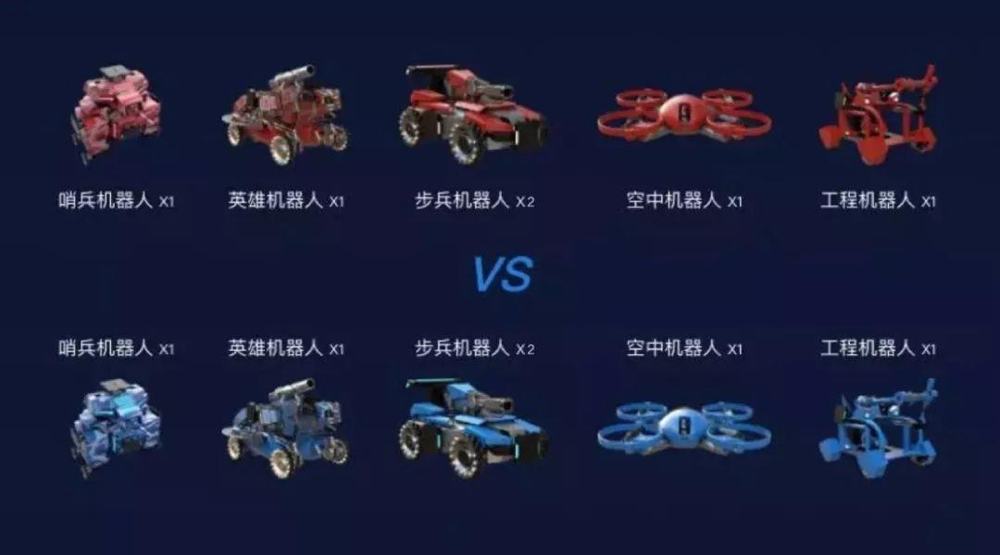
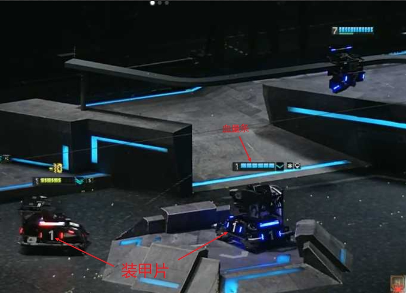
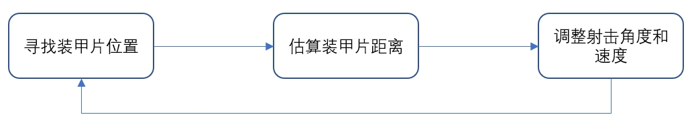
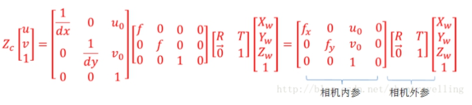

### 背景介绍  
RoboMaster是一个全国大学生机器人竞赛，是一个以射击为主的机器人竞赛  

团队在规则允许的范围内自主研制机器人  
   
每种机器人都有一定的血量，如果血量归零，机器人被淘汰。   

比赛过程中英雄机器人、步兵机器人、空中机器人、工程机器人由团队成员控制，哨兵机器人为自动机器人。英雄机器人、步兵机器人、空中机器人、哨兵机器人可发生弹丸，若弹丸击中对方机器人身上安装的装甲片，被击中的机器人就会被扣除一定量的血量，若某方机器人全部被淘汰或者某方的基地机器人被淘汰，则输掉比赛。所以比赛的其中一个重点是如何更快更精准得打击对方机器人。  
   

### 主要贡献  
1、负责开发维护各类机器人的自动射击模块

### 自动射击模块功能  
自动射击模块主要分为三个部分  
1. 寻找装甲片位置
2. 估算装甲片距离
3. 调整射击角度和速度  

  

### 功能实现  

* 寻找装甲片位置  
  
寻找装甲片位置的目的是寻找自动打击的目标。如上图所示，装甲片是一个矩形金属板块，装有压力传感器以及发光灯条和贴有号码牌，压力传感器用来感应是否受到打击，发光灯条和号码牌为装甲片标志物。  

在实现过程中，主要关注的是更为明显的发光灯条标志物。  

算法流程：
1. 成像  
2. 寻找符合条件的发光物作为灯条的候选  
3. 两两组合灯条候选，判断其是否构成一个装甲片
4. 保存符合条件的装甲片
5. 从保存的装甲片中按照一定的规则选取需要打击的单个装甲片

成像是整个系统中非常重要的一步，比赛场地会存在比较大的环境干扰因素，但因装甲片有明显的发光标志物，所以我们采用了高帧率，低曝光率的工业相机作为成像设备，通过设定低曝光时间，能过滤掉场地中大部分的干扰物，同时能对发光物体有较好的成像效果。  

寻找灯条候选首先会对图像进行二值化，然后寻找轮廓，并按照规则依次判断每个轮廓是否是装甲片。  

两两组合灯条候选，判断其是否构成一个装甲片也是通过一系列的规则进行判断。  

通常处于画面中心的目标是最理想的打击目标，所以我们会优先选择离中心最近的打击目标，可以通过重载类的小于操作符，实现类按照离中心距离实现升序排序。  

* 估算装甲片距离  

在实际测试过程中，会发现弹丸射击存在弹道现象，也就是会出现弹道抛物线，造成了就算找到装甲片也可能打不中的情况，最直接的方法就是测量出需要打击的装甲片离相机的距离（相机位于枪管上方），进而根据目标距离调整枪口的角度以及发射弹丸的速度，实现更加精准的打击。  

上述问题属于单目测算深度问题，可以通过像素坐标和世界坐标的转换实现  
  
(u, v)是像素坐标，Xw, Yw, Zw是世界坐标，Zc是相机坐标的深度。  

从上述公式可得，我们只需要知道相机内外参，以及世界坐标的坐标点，和其在像素坐标中的对应点，就可以计算出世界坐标的坐标点所对应的相机坐标的深度。  

相机内参可以通过相机的畸变矫正获得，我们可以把需要打击的装甲片中心点设置为世界坐标原点，即（0，0，0），所以我们需要求解的只有相机外参。  

相机外参可以通过求解PNP问题得出，因为我们可以得到装甲片的四个顶点，在设定装甲片中心为世界坐标原点的前提下，是可以知道这四个装甲片顶点的世界坐标的，我们也能找到这四个顶点的像素坐标，所以能够求解这一PNP问题。  

* 调整射击角度和速度  

这一过程通过PC和下位机的串口通信实现，PC根据计算出来的信息，发送相应的信号给下位机。  

### 实现环境和结果  

* 实现环境  
Ubuntu 16.04   
OpenCV 3.4+  
C++  

* 实现效果  
FPS ：40  
单目测距精度：三米内误差在10厘米内  
命中率：运动情况下40%左右
