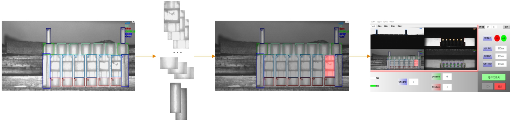

### 比赛内容  
每个队伍都对应一个泰科电子的工厂，各队的任务不一样，任务由对应的工厂工程师安排，最后根据方案效果和方案完成度进行评分。  

我们队伍的任务是，对一种注塑元器件进行表面缺陷检测，工厂原有的检测是采用传统视觉方法，通过测试图片和注册图片的差分结果进行缺陷判断，效果不好。需要检测的元器件如下图所示。  
  

比赛中需要质检的注塑元器件**较难获取到负样本**，所以我们最终采用了目标区域定位+自监督缺陷检测的方案。定位出预先定义好的区域之后，将这些区域图片输入到训练好的自监督缺陷检测模型，得出最后的质检结果。  

  
  

### 功能实现  

主要功能：  

* 区域定位  
* SVDD缺陷检测  
* 应用部署  

**区域定位**：注塑元器件需要检测的区域是固定的，我们根据工厂的要求将注塑元器件分解成不同的区域。区域定位使用的是使用Tensorflow复现的[YOLOv4](https://arxiv.org/pdf/2004.10934.pdf)算法，采用通道裁剪和层裁剪的方式加快模型推理速度，同时加大模型分辨率（1600*544），重新聚类Anchor，增加grid mask用以提升目标区域的定位精度。在RTX2060环境下，推理速度可以达到25FPS，在测试集上，@0.8mAP=0.99，@0.9mAP=0.833。  

**SVDD缺陷检测**：在实际生产过程中，比较难获取到存在权限的样本，且出现的缺陷样本各式各样，使用普通的分类模型效果不好，我们在比赛过程中采用了[deep SVDD](http://data.bit.uni-bonn.de/publications/ICML2018.pdf)，使用单分类的思想去做异常检测，这样做的好处是，既可以免去收集负样本所需要的大量时间，也可以实现预警新缺陷的功能，在自建测试集上，在保证误检率在1%的情况下，缺陷召回率能达到100%（可能是收集负样本较为简单）。  

需要注意的是，使用SVDD一定需要使用验证集进行阈值划定，才能应用在测试集或者实际应用场景。下图是一些目标区域的聚类效果。  
  
  

**应用部署**：因为工厂的硬件只支持Windows系统，且只有C++驱动，所以我们最后使用[TVM](https://tvm.apache.org/)推理框架对模型进行转换，转换后的C++接口模型推理速度能进一步提升，如目标检测帧率可以从25FPS提升到45FPS（Ubuntu上测试效果）。之后将模型迁移到Windows上时，推理速度只有40FPS左右，可能是因为TVM在不同系统的底层实现不一样的。  

### 实际部署效果  
在设备上运行一段时间，相较于工厂的原检测算法效果是更好的，能检测出原来检测不到的缺陷，但是可移植性会比原算法要差，我们比赛的过程中只使用了一台生产设备上采集的数据，在这台设备上我们能有更好的结果，但是在迁移到其他设备上时，会因为成像质量的差异（工厂现有的设备，同种型号的成像差距也是比较大的），造成精度的损失，这个问题在原算法上也有，但是因为原算法是传统算法，调整起来比较方便，而我们的算法则需要采集更多的数据进行finetune。  
