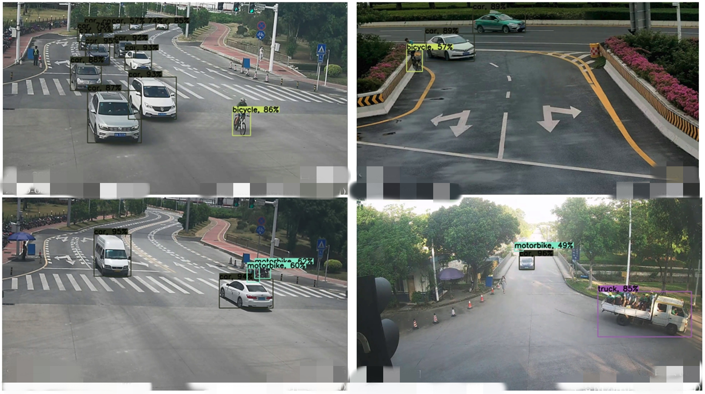
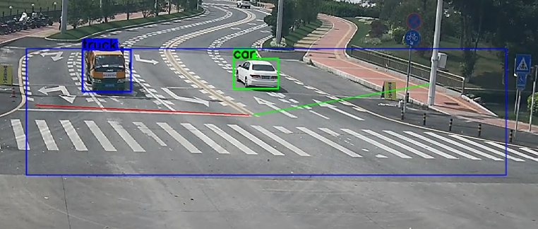
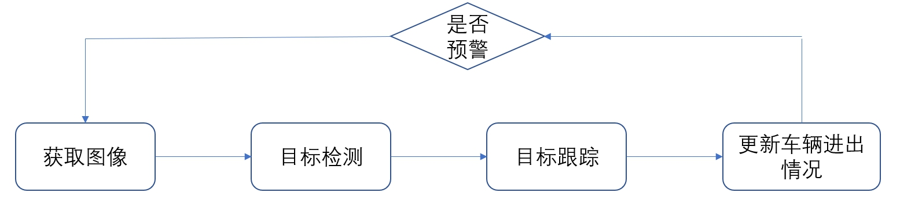
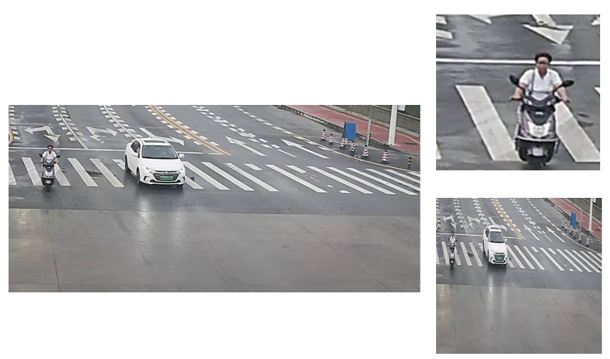

### 项目内容  

对白云机场区域的进出道路口进行监控，统计进出机场区域的各类车辆的情况（汽车、货车、巴士、自行车、摩托车）。    

  
  

### 项目流程  

  

因为目标跟踪的标注成本比较大（需要ID标注），在项目过程中我们只标注了目标检测中需要的矩形框，但我们需要物体的移动轨迹才能更加准确地估计出车辆的出入情况，所以我们在目标检测之后加了一个非深度学习的目标跟踪模块。先通过目标检测检测出车辆，然后通过SORT算法判断车辆是否有离开或进入预先设定好的虚拟线圈。  

目标检测算法采用的是YOLOv4算法，目标跟踪算法采用的SORT算法。  

### 功能实现  

主要功能：

* 目标检测
* 目标跟踪

**目标检测存在的问题**：  
1. 存在类别不平衡现象，摩托车、自行车的实例数比较少。  
2. 需要全天候检测（黑夜、白天、晴天、雨天）。  
3. 为了保证SORT算法的准确率，目标检测的帧率不能太低。  
4. 部署的时候因为检测区域是人为设定的，可见图二，在这种情况下，我们的输入不能进行resize，只能原图输入。  

对于**问题1和问题2**，我们的做法是从数据入手解决问题.对于问题1，我们对出现摩托车和自行车的图片进行合适比例的过采样。对于问题2，我们从白云机场收集了全天候的数据。（从六个出入口监控，各自抽取一个星期的录像，然后人为选取抽帧区域，最终得到了2W张左右图片数据）。除此之外，还从VOC和COCO中把存在摩托车、自行车的图片抽取出来，依次增加数据量。  

**问题3**，为了保证帧率，我们从**模型输入，模型大小，模型部署**三个角度进行优化。  

**模型输入方面**，采用从原图中截取的目标区域，而不是全图（因为我们只需要关注特定的地方就能统计车辆进出情况，不必全图检测）。可见第二幅图的蓝色大框。  
**模型大小方面**，我们使用知识蒸馏的方法，在精度下降允许的范围内，尽可能压缩模型，使用的方法是[Distilling Object Detectors with Fine-grained Feature Imitation](https://openaccess.thecvf.com/content_CVPR_2019/papers/Wang_Distilling_Object_Detectors_With_Fine-Grained_Feature_Imitation_CVPR_2019_paper.pdf)。最终在精度@0.5mAP下降2%的情况下，模型体积减少一半，推理速度提升40%。  
**模型部署**，我们在模型部署的时候，采用Tensorflow集成的TensorRT模块，把模型转化成TensorRT模型，进一步提升速度。（尝试过TVM，但是在使用TVM时，需要auto-turning才能获得和TensorRT一样的效果，auto-turning时间较长，最终没有采用。）  

**问题4**，部署的时候，不同的摄像头，采取的目标区域大小是不一致的，如果将这些区域都resize成固定大小输入，会造成测试数据的分布与训练数据分布不一致。所以我们最终采取了目标区域长宽resize成最接近32的倍数的长度后，直接作为网络的输入。  
既然测试输入是原图输入，在训练的时候我们也应该让网络尽可能地适应原图大小的输入，但训练的时候输入大小通常是固定的，为了解决这个问题，我们增加了一个数据采样模块，采样模块的根据样本中实例的位置，从图中裁剪出一个大小接近输入大小的区域，这样就保证了采样过后的输入的区域是原图大小，每次输入以0.5的概率使用这一采样模块。这一采样模块也能解决大尺寸图片的训练问题。  

由上图为采样结果，右下图为直接resize结果。  

  

**目标跟踪**  
目标跟踪方面，因为没有进行ID信息的标注，只是使用了SORT算法。  

### 实际应用效果  

原始目标检测精度：0.5@mAP：0.81  
原始目标检测速度：130 ms/frame  

蒸馏后目标检测精度：0.5@mAP：0.79  
蒸馏后标检测速度：80 ms/frame  

