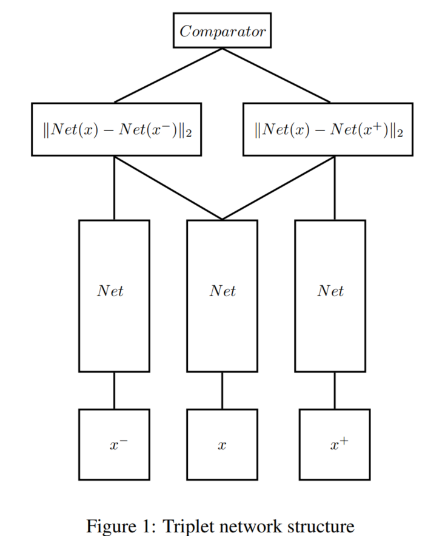
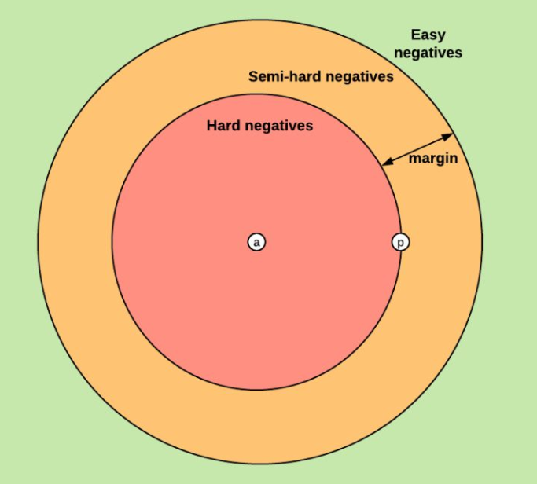
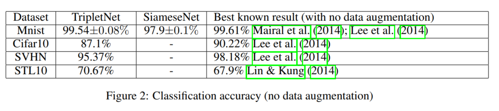

## DEEP METRIC LEARNING USING TRIPLET NETWORK
阅读笔记 by **luo13**

**对于度量学习的一些理解**  
度量学习的目标是学习到两个图片之间的相似度  
度量学习其实是分类算法的一个分支，但度量学习可以学习到两个图片之间的相似度，但不能显式地判断属于哪一类别。而识别网络是用于将输入规划到具体的类别当中，但是识别网络的一个问题是，必须提前设定好分类的类别。

### 网络结构
  
**为什么要三个网络共享网络，为什么不能使用$3\times N$的一个batch？**
### 模型优点

### 模型缺点

### 损失函数
$$Loss(d_+,d_-)=\|(d_+,d_--1)\|_2^2=const\cdot d_+^2$$
$$d_+=\frac{e^{\|Net(x)-Net(x^+)\|_2}}{e^{\|Net(x)-Net(x^+)\|_2}+e^{\|Net(x)-Net(x^-)\|_2}}$$
$$d_-=\frac{e^{\|Net(x)-Net(x^-)\|_2}}{e^{\|Net(x)-Net(x^+)\|_2}+e^{\|Net(x)-Net(x^-)\|_2}}$$
$$Loss(d_+,d_-)\rightarrow0 \quad iff \frac{\|Net(x)-Net(x^+)\|}{\|Net(x)-Net(x^-)\|}\rightarrow0 $$  
与正样本的距离尽可能小，与负样本距离尽可能大  
### 实验细节
**采样策略**  
  

### 性能指标
  
TripletNet和SiameseNet都是论文作者的结果，但是很奇怪的是他说SiameseNet有几个结果做不出来
### 疑问

