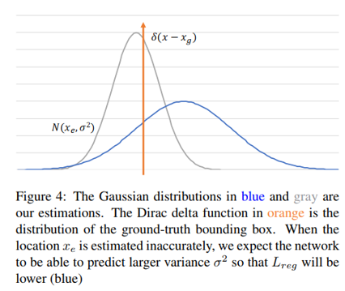

## Bounding Box Regression with Uncertainty for Accurate Object Detection
阅读笔记 by **luo13**  

这一论文提出的问题是，目标检测数据集中的标注可能是不准确的，我们直接用这些标注进行训练可能会导致收敛困难，精度下降的问题。但是直接修改标注框是不可行的，所以作者对预测结果做了修改，除了直接预测左上右下两个坐标点，还预测了这两个点的置信度，从而让网络自行去判断这一个点是否可信。但论文比较别扭的地方是gt的制作，gt是根据标注的点生成的冲击函数，而置信度预测值是方差，以坐标预测值为均值，置信度预测值为方差建立一个高斯模型，与gt的冲击函数作对比，坐标预测值越接近真实值，方差应该越小，坐标预测值离真实值越远，方差越大。预测出来的方差又可以用到NMS的阶段，通过使用重叠边框的方差作为权重，重新生成新的边界框，从而提高精度，**但是gt的制作直接使用了标注的信息，也就是说这个冲击函数可能是错误的，其实没解决标注有误的情况**，只是一定程度上让网络去自适应这种误差。**需要注意的是方差预测值只是用作NMS阶段合并重叠框来生成新的边界框，而并不是用它来选择有目标的边界框。**

   

文章里说到，本文的预测目标其实是一个高斯模型(可以使用其他模型，作者没有去做尝试，我觉得很多时候高斯模型的效果就比较好了)  

**目标函数**  
  
  
  

损失函数是KL散度，L=0，说明预测函数与目标函数一致。所以xe与xg越相近，方差越小，损失会越小。但如果预测出来的xe与xg相差比较大，这时候预测的方差会倾向大方差（可以使损失变小，没有去具体的计算过）  

但是直接使用方差会导致梯度爆炸的出现，对函数进行了一些修改。  
  
方差为1的时候其实就是L2损失了。  

  
三次方那里容易导致梯度爆炸  

  

但是对xg-ex的绝对值大于1的情况，也是为了减小梯度爆炸的概率，改用了一个类L1损失  
  

估计的概率密度函数用于NMS  
  
  

小结：切入点很有趣，虽然感觉上没有从根本解决问题（也不好解决），但使用高斯分布拟合置信度这一想法值得参考。
