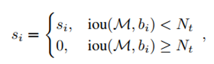
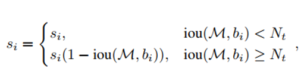
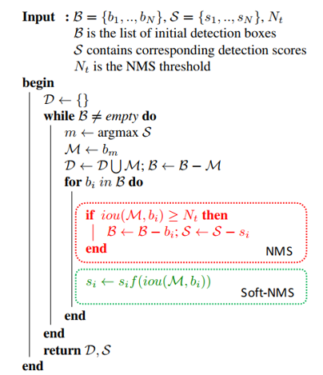

## Soft-NMS – Improving Object Detection With One Line of Code
阅读笔记 by **luo13**  
2020-3-3  

soft-NMS的思想其实很简单，标准的NMS会选取得分最高的一个候选框，然后比较其他候选框和该候选框的IOU，如果IOU大于设定的阈值，则将其得分置零。但是作者考虑到，会不会有一个候选框，与得分最高的候选框的IOU大于阈值，但是它其实是检测到了另一个目标实例，但是得分又刚好低于得分最高的候选框，这样的话就会导致目标出现漏检测。直观的解决方法是将NMS的IOU阈值提高，但是提高阈值又会增加出现误检测的概率。所以作者提出了一种新的NMS方法，将得分较低的候选框得分降低，而不是置零。对密集目标的预测应该会有帮助。  

**标准的NMS**  
 

**soft-NMS**  
  

**算法流程**  
   

小结：soft-nms可以一定程度的解决密集目标的问题，但是其实还有一个问题，但就是再进行soft-nms之后，相当于给所有的检测框重新计算了得分，这里需要人为设定一个阈值，再次筛选认为是含有目标的检测框，这一部分感觉是可以继续优化的地方。其实这个地方也挺难选的，涉及到分数的地方其实一定会有一个硬性的指标去选择认为是正确的事情，就看用什么策略确定这个指标。  
