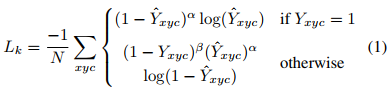

## Objects as Points
阅读笔记 by **luo13**  
2020-3-3  

这篇文章除了适用于普通的目标检测，还适用于3D目标检测以及人体关键点检测。主要是看了普通目标检测的部分。论文提出的方法性能上看起来挺不错的。有一个比较好的accuracy-speed trade-off。这篇文章除了适用于普通的目标检测，还适用于3D目标检测以及人体关键点检测。主要是看了普通目标检测的部分。论文提出的方法性能上看起来挺不错的。有一个比较好的accuracy-speed trade-off。  

   

**Loss**  
   
   
方差的确定与cornernet一样是根据物体大小来确定的。  

   
R是下采样的倍数，~p是不进行取值的目标值，O是预测的偏移值。也是只在中心点位置才进行预测。  

   

小结：cornernet出现后使用中心点进行预测是很容易想到的一个点，但这篇文章没有解决中心点被遮挡的问题，感觉上文章的亮点在于这个算法很容易应用到3D目标检测和人体关键点检测。而且文章是直接就去预测中心点，没有加入任何的其他信息或者限制，虽然实现起来很简单，但是从作者给出实验细节里一个网络需要八卡五天才能训练好可以看出，这个网络还是比较难收敛的，可能是因为学习的目标不是很明确。  
