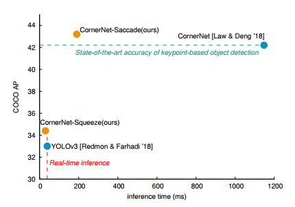
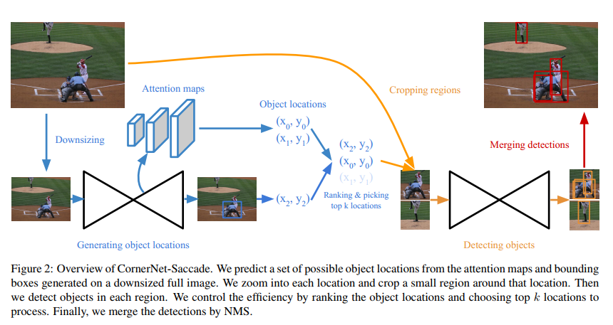
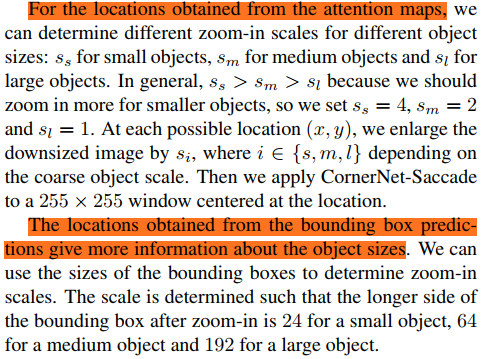
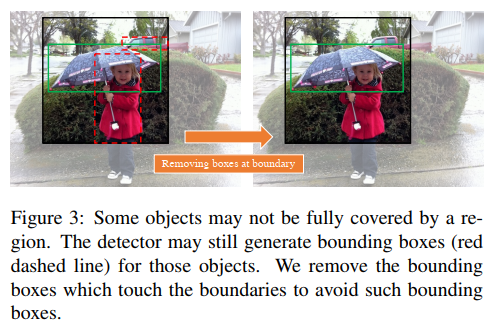
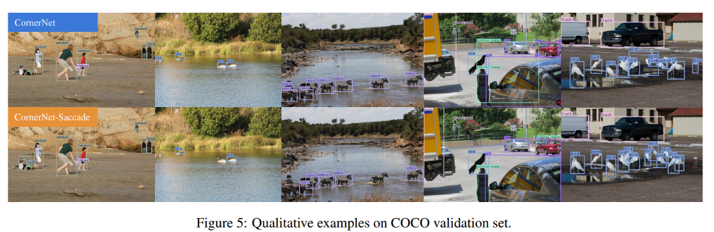
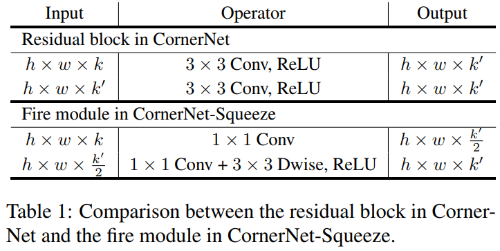

## CornerNet-Lite: Efficient Keypoint Based Object Detection
阅读笔记 by **luo13**  
2020-3-3  

cornernet-lite，是cornernet的改进版本。这篇论文包括了两个改进算法，分别是cornernet-saccade和cornenrnet-squeeze，相比于cornernet，cornernet-saccade在性能和速度上都有提升，cornenrnet-squeeze性能上会差一些，但是速度上会有非常大的优势，且cornenrnet-squeeze在coco数据集上速度和得分都要高于yolov3。  

   

**cornernet-saccade**  
cornernet-saccade采用了扫视的概念，cornernet需要对全图的像素点进行计算，cornernet-saccade通过减少需要计算的像素点来提升速度，又因为采用了扫视的方法，对目标的检测精度得到了提升。个人感觉扫视跟RPN网络有点相似，也是从原图片中提取出一个感兴趣区域。相当于二阶段的优化而且减少了计算量。

   

网络的输入是两个图片（为什么是两个图片作者没有具体说），一个是255*255，一个是196\*196并且0-padding到255\*255，合并之后一起输入到沙漏网络，从沙漏网络decode部分不同的层提取出三个注意力图，通过和cornernet相似的方法提取出saccade的边界框，并且沙漏网络最后也会输出一个坐标。作者定义了大中小三个尺寸，根据两个分支得到的object locations分别从不同尺寸的图片中得到saccade区域。后面接是接入了一个和cornernet一样的结构（网络会小一些）去检测边界点，组合之后进行NMS得到边界框。对于每一个saccade区域，只保留没有与边界接触的边界框。  

   
   

但从作者放到论文中的效果图看，感觉对一些小目标或者密集目标的预测还没有cornernet好。  

   

Cornernet-squeeze是把backbone的模块换成了squeeze里面的fire module。  
   

小结：saccade感觉像是增加了一个再次回归的功能，能提到检测精度也可以减少计算量。但是但是对密集物体的预测或者小物体的预测可能不好。对于小物体，saccade的输入图片很小，可能saccade区域根本就提取不了小物体。对于密集物体，saccade区域很容易在边界处存在物体，按照文章中去掉与saccade边界接触的边界框很可能会检测不出密集物体。减少计算量的策略值得学习，但怎么减少计算量又能保持精度是个问题，感觉总会有trade-off。  
