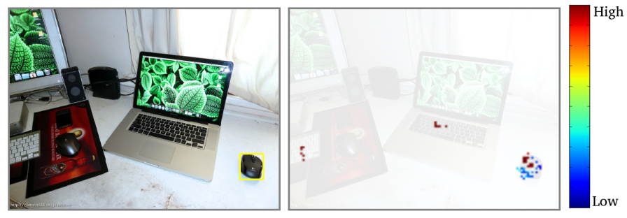
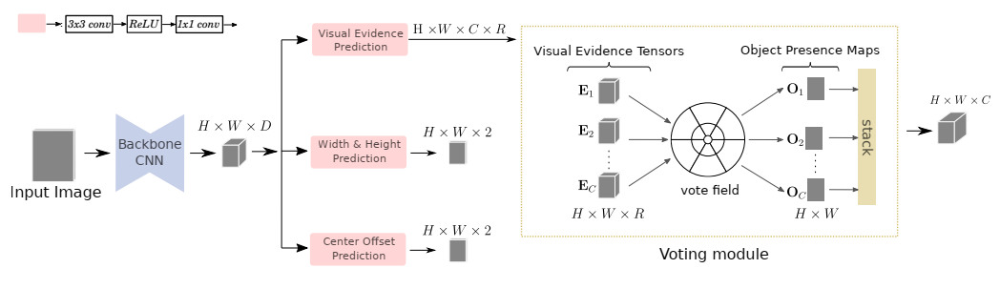
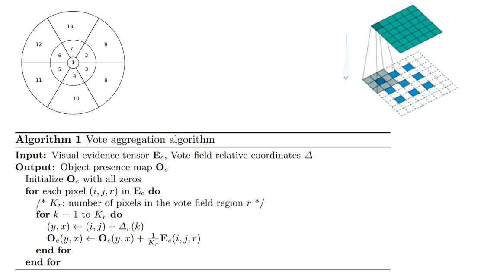
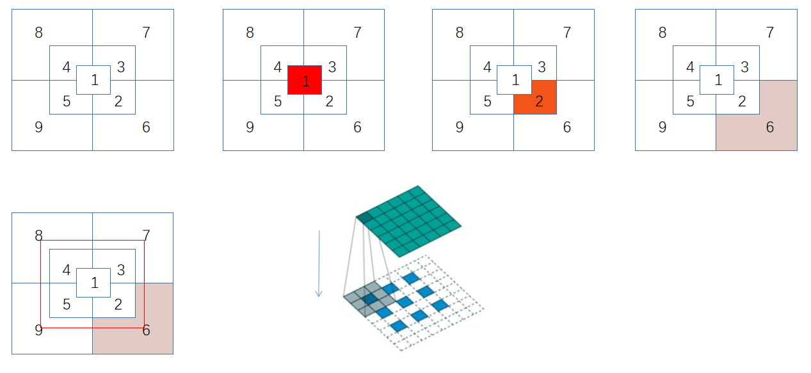

## HoughNet: Integrating near and long-range evidence for bottom-up object detection
阅读笔记 by **luo13**  
2020-3-21  

本文贡献：  
1、使用投票机制获得分类结果  
2、将polar坐标应用到投票机制当中  

  
  

整体网络是centerNet结构，分类分支使用了投票机制  

  

投票方法是每个点根据region对其他点做投票，相当于一个点恢复出一个特征图，这一操作可以使用反卷积完成

  

反卷积核的大小可以根据每个region离中心点的距离和大小确定
