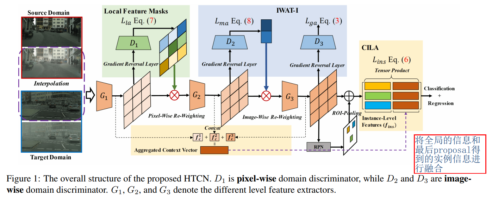
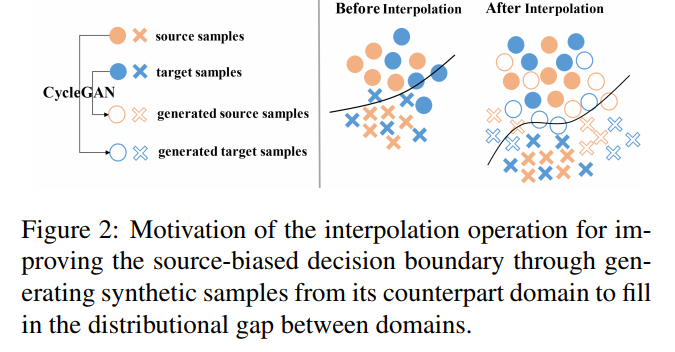

## Harmonizing Transferability and Discriminability for Adapting Object Detectors
阅读笔记 by **luo13**  
2020-5-22  

这篇文章提出一个调节可迁移特征与辨别性特征的目标检测域适应方法。  
域适应是指，使用源域数据（带标签）和目标域（不带标签或者带弱标签）训练检测器，要求检测器在目标域上表现良好。  

  
网络结构是基于对抗训练的网络，local feature masks用于加强可迁移特征（如汽车中的轮廓应该在每个域中都相似），IWAT-I从图像层面加强可辨别的特征，用于定位和分类，CILA从实例层面（proposal）加强可辨别特征（图中的CILA部分是没有判别器的，目标域缺少类别信息也应该是不能进行对抗训练的，但不知道为什么这里作者还是使用了一个对抗损失）。  
源域数据在三个部分都有loss，而目标域因为缺少标注，只能在前两个部分有loss。

  
最终的分类决策面是由源域决定的，但可能存在源域分类较好，但是目标域分类不好的情况，所以使用cyclegan进行插值，得到的新数据集，这样效果会更加好。  

疑惑的地方：作者在文中说到，浅层应该加强可迁移特征的学习，深层应该加强判别性特征的学习，但是作者在local feature mask中加强了每个域特有的信息（也就是判别性强的特征），在IWAT-I中又加强了域间通用的信息（也就是可迁移特征）。感觉与一开始的设定矛盾了，这里没有理解透。  

