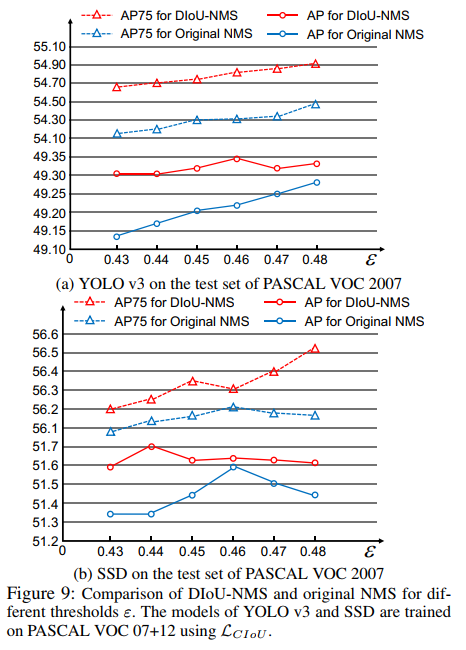

## Distance-IoU Loss: Faster and Better Learning for Bounding Box Regression
阅读笔记 by **luo13**  
&nbsp;  
**个人感觉**  
在iou loss上加入了中心点距离的惩罚项以及预测框长宽比的惩罚项，相比于GIOU的改进是，当预测框在gt内部的时候，可以使预测框中心点与gt中心点重合。感觉其实可以将GIOU和DIOU进行合并使用。  

**损失示意图**  
  
&nbsp;  

**IOU-based LOSS**  
  

**DIOU LOSS**  
考虑中心点的距离  

**CIOU LOSS**  
考虑角度问题   
   

**NMS-distance**  
进行NMS的时候考虑中心点的距离信息  
  

**效果**  
  
  
  
  
