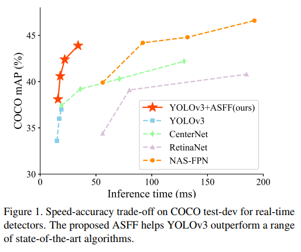
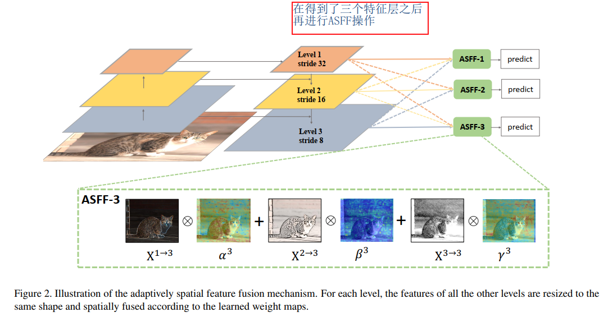
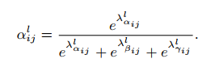
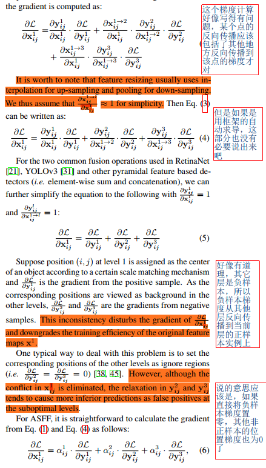
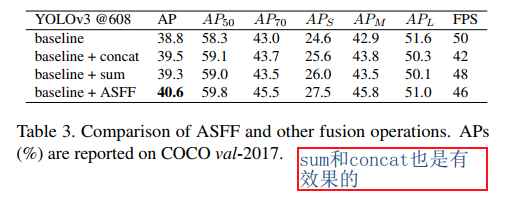

## Learning Spatial Fusion for Single-Shot Object Detection
阅读笔记 by **luo13**  
2020-5-16  

这篇文章关注到了特征融合当中出现的特征冲突现象，并提出了一个自适应的特征融合方式缓解上述提到的问题。  

开源链接：  
https://github.com/ruinmessi/ASFF  

文章贡献：  
1、提出了一个新的特征融合方式。  

特征融合中的特征冲突指的是，以YOLOv3为例子，如果每个点再y1层是正样本，因为label assign的规则，不同特征层进行融合的时候，这一个点对应的其他特征层的点可能就是负样本，这时候反向传播就会使得负样本的梯度传向正样本。（但从文章的推导来看，这只会存在于直接resize之后相加或者concat的情况，如果再加卷积应该是不会发生这种情况的，作者的自适应权重层也是通过卷积得到的，只是限定了全部层的相应权重相加之后等于1）  

  
  
 
 
 

从作者的消融实验来看，sun和concate也是会有效果的，但是会存在上述提到的特征冲突问题。  

作者的baseline使用了不少tricks做了一个加强版的YOLOv3，可以参考一下开源的代码
