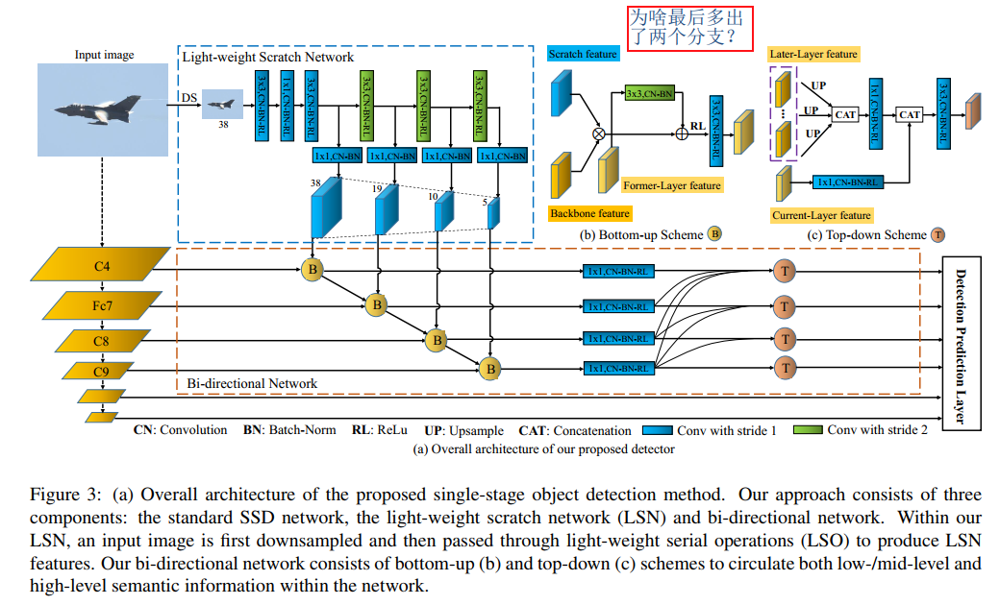
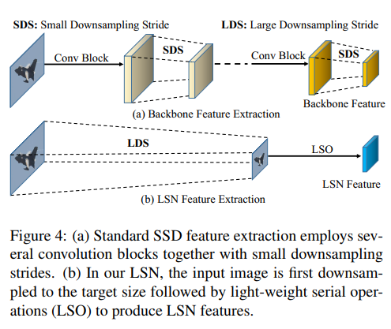
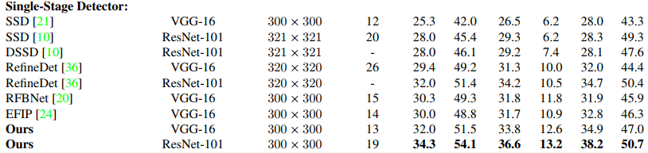
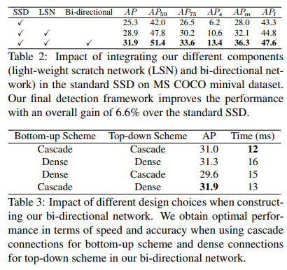

## Learning Rich Features at High-Speed for Single-Shot Object Detection
阅读笔记 by **luo13**  
2020-5-12  

本文贡献：  
1、提出了一个新的目标检测框架。  
2、探究了特征信息上下双向融合的重要性。（特别是中小物体检测的收益会增大）  

  
网络结构基本框架与SSD是一样的，不同的地方有三个：  
一、多了两个特征层，但这两个层并没有参与到双向特征融合当中。作者没有太多描述。  
二、使用LSN模块，增加较少计算量，使用bottom-up的方法为网络提供中小特征信息。  
三、使用top-down方法，以dense的形式结合高级语义特征，  

  
LSN模型，可以以较少计算量取得不错的收益。  

  
速度只比SSD慢了一点点，但是效果提升很明显，显然文中使用的特征融合的解构能为目标检测带来更多的重要特征。  

  
LSN和双向融合都对baseline都有较大的提升，bottom-uo使用级联，top-down使用稠密连接，效果最好  
