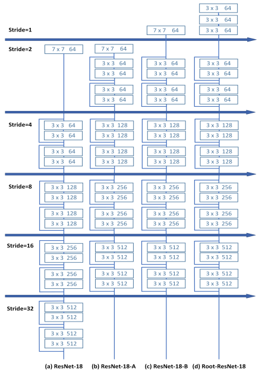

## ScratchDet: Training Single-Shot Object Detectors from Scratch
阅读笔记 by **luo13**  
2020-4-15  

这篇论文是2019CVPR的Oral，但其实创新性并不是很足，可能是实验做得比较好吧。  
文章贡献：  
1、通过实验证明BN层对于检测网络非常重要  
2、通过实验证明，过早降采样会导致目标检测所需信息的严重丢失  

文章主要可以分为三个部分的实验  
1、使用随机初始化，没有使用预训练模型的SSD（使用VGG-16，没有BN）作为baseline，在VOC2007 Test上67.6%mAP，在分类回归子网络加入了BN，提升到了71%mAP 

2、使用随机初始化，没有使用预训练模型的SSD（使用VGG-16，没有BN）作为baseline，在VOC2007 Test上67.6%mAP，在主干网络加入了BN，提升到了72.8%mAP 

3、对ResNet-18网络结构的调整，得出了过早降采样会丢失大量目标检测信息以及降采样前进行卷积运算可以提取更多检测信息的结论。提出了一个新的网络结构，但是这个结构也会加大运算量（虽然减少了每层输出的通道数）  
  

小结：证明了BN的重要性，证明了在检测网络中过早降采样会丢失检测信息。但修改的网络其实增加了运算量。

  
