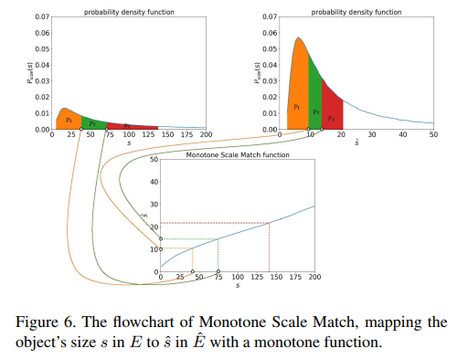

## Scale Match for Tiny Person Detection
阅读笔记 by **luo13**  
2020-5-2  

这篇文章提出了一个新的小目标数据集以及一个用于将已有数据集分布转换到目标数据集分布的算法  
文章贡献：  
1、提出了新的小目标数据集  
2、探讨了物体的绝对尺寸和相对尺寸对目标检测的影响  
3、提出了一个用于将已有数据集分布转换到目标数据集分布的算法  

  
tiny_person的绝对小物体和相对小物体都要多于其他数据集  

  
绝对大小和相对大小的计算方法  

  
各数据集的绝对大小和相对大小对比  

  
为了探究绝对大小对目标检测的影响，作者将cityperson是缩小了进行试验，能发现缩小后的误检率会提升，说明绝对大小对目标检测有比较大的影响（这里应该训练也是用缩小后的图片，不然重新resize感觉绝对大小就没变了，也可能训练的时候是padding，具体可以看开源代码）

  
为了探究相对大小的影响，作者将tinyperson和tinycityperson都进行放大，发现tinycityperson有较大提升，而tinyperson提升较少，从而说明了相对大小的影响。（这里其实觉得有点奇怪，感觉这提升也太小了）  

  
作者认为已有的数据集如果物体尺寸分布与目标数据集差距过大，则使用已有数据进行预训练会影响目标检测器最后的性能，所以作者提出了一种sm算法，将已有数据的分布转成目标数据的分布  

按照之前的分析，如果绝对尺寸和相对尺寸的分布都能转换当然最好，但是相对尺寸的转换在单幅图片上是办不到的，所以作者最后只转换了绝对尺寸（这里比较疑惑的是，如果转换了绝对尺寸，是否训练的时候只能用相应的尺寸了，不然就有可能又变回去）  

  
  
  
  
因为对尺度进行采用的时候，有可能选取的尺寸和原来尺寸差距很大，造成放缩之后图片不合理，所以作者采用了一种单调递增的采集方法，确保转换的合理性，具体的算法都在图里面，这里就不重复讲解了  

  
因为图片尺寸较大，训练和测试采用的都是裁剪的方法  

小结：物体的绝对大小和相对大小都会对目标检测有影响。对于尺寸较大的图片可以裁剪训练和测试（但这样测试很耗时）

