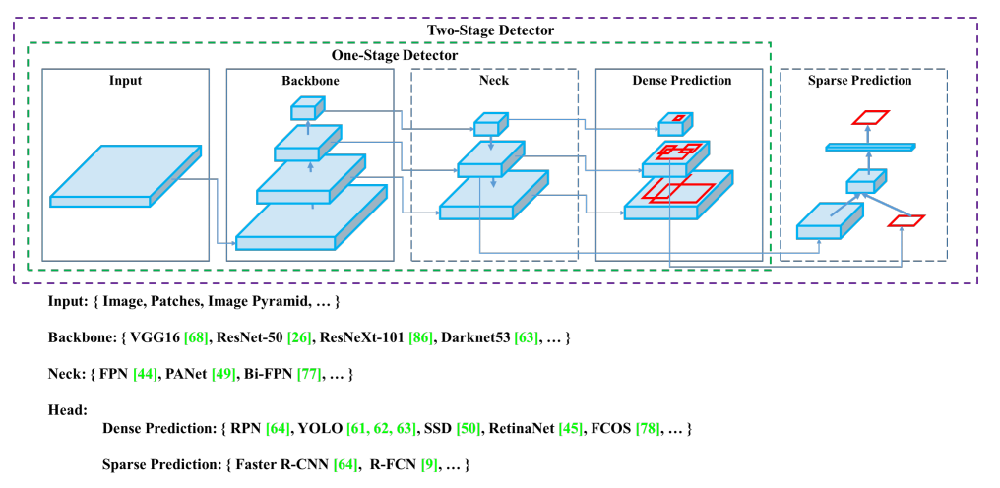

## YOLOv4: Optimal Speed and Accuracy of Object Detection
阅读笔记 by **luo13**  
2020-5-10  

这篇论文是Yolov3的升级版，精度和速度较前面的yolo版本都有提升。这篇论文对目前的目标检测框架进行了总结，并结合多种tricks做了非常多的实验，最终达到了SOTA的效果。  

本文贡献：  
1、对已有的目标检测技术做了各种组合实验，得到了最好的组合。  
2、提出了新的数据增强方法，Mosica，这个方法跟之前siticher非常相似，没有单独对比过效果，但感觉siticher只是Mosica的一个简化版本。  
3、对SAM、Cross-BN，PAN，darknet-53进行了修改。  

  

这里的yolov3和v4速度其实相差不多，虽然说是在V100上面的速度，但感觉比自己测的v3速度要快很多，应该是复现的时候有些事情没有考虑到。  

  
这是作者对一阶段目标检测和二阶段目标检测的框架整理，最大的区别就是预测层的不同，这里也是二阶段目标检测算法要远慢于一阶段目标检测算法的原因。

  
这是作者对上面框架每个部分列举出来的一些候选的结构。  

  
网络设计的总结，让人比较惊讶的是，每秒浮点计算次数其实与参数量以及每一层的平均大小并无关系，但不是很清楚这些指标是怎么统计出来的。  

  
BN层方面作者对cross-BN做了一些修改，使其更适合但GPU训练。感觉上其实是在用minibatch模拟多GPU的情况，与darknet原生的训练方式有些类似，但主要是会在batch中累计每个minibatch的更新，并在最后一个minibatch将所有参数更新。  

作者在文章中列出了大量的实验结果，可以通过实验的结果了解各个部件对最后检测结果的影响。[yolov4](https://github.com/AlexeyAB/darknet)的github官网上也提供了很多不同的trick，有些是通用的算法加速方法，有些是目标检测的triks。  

BN和数据增强对目标检测的影响非常大，这部分的内容后面要详细看一看。  
