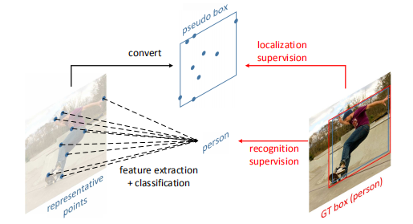
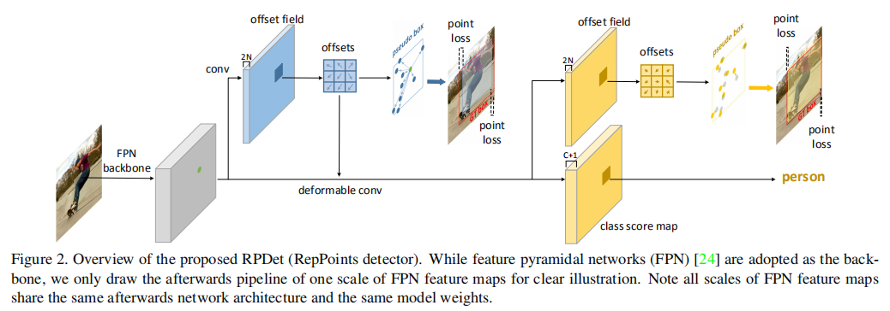
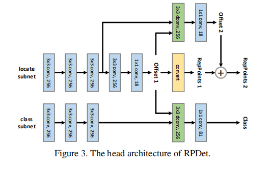
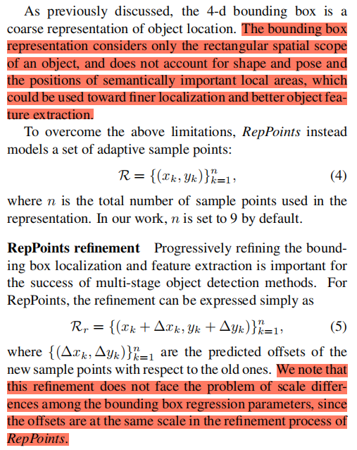
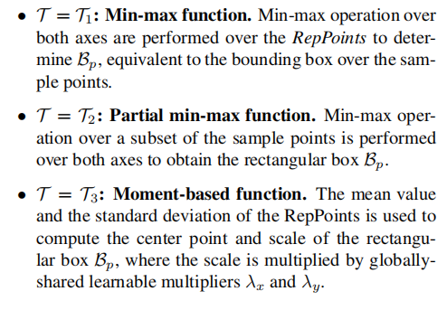
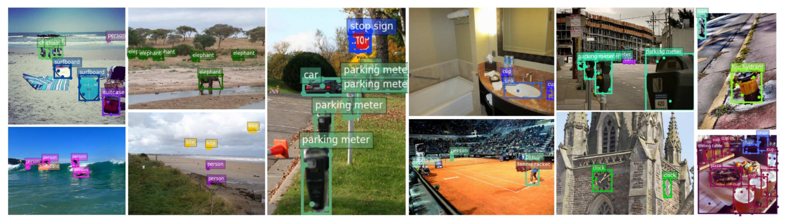

## RepPoints: Point Set Representation for Object Detection
阅读笔记 by **luo13**  
2020-7-3  

这篇论文严格意义上不能算作一阶段目标检测方法，因为其进行了两次目标框的回归，但又只进行了一次分类，所以更像是1.5stage。  

文章贡献：  
1、使用分类和回归明确可变卷积的学习目标  
2、使用表征点代替矩形边框  

  
文章使用表征点代替矩形边框，但最后的输出还是边界框，相当于是弱监督学习。  

  
网络使用FPN作为基础网络，FPN输出的特征图经过一次可变卷积，得到第一次的表征点。第一次的表征点受回归loss和分类loss的监督，回归loss可以限制可变卷积学习的offset区间，而回归loss则是让可变卷积学习到可以表征物体的特征。  

  
具体的网络结构还得看看源代码，像是绿色的卷积后面是有group normalization的，这些得看看源代码。  

  
选取9个点，初始位置都在中心点，经过第一次预测之后的点作为第二次的初始点。  

  
作者提供了三种方式，作者大部分实验采用的是第一种方式。  

  
大部分的点存在于边界，但也有些点存在物体内部，这些在内部的点不知道与分类有没有关系。
