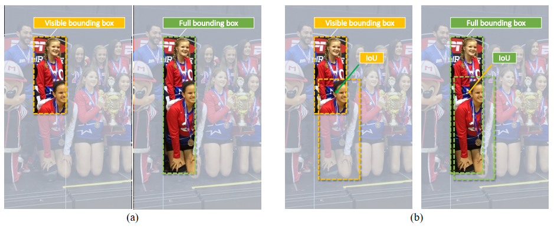
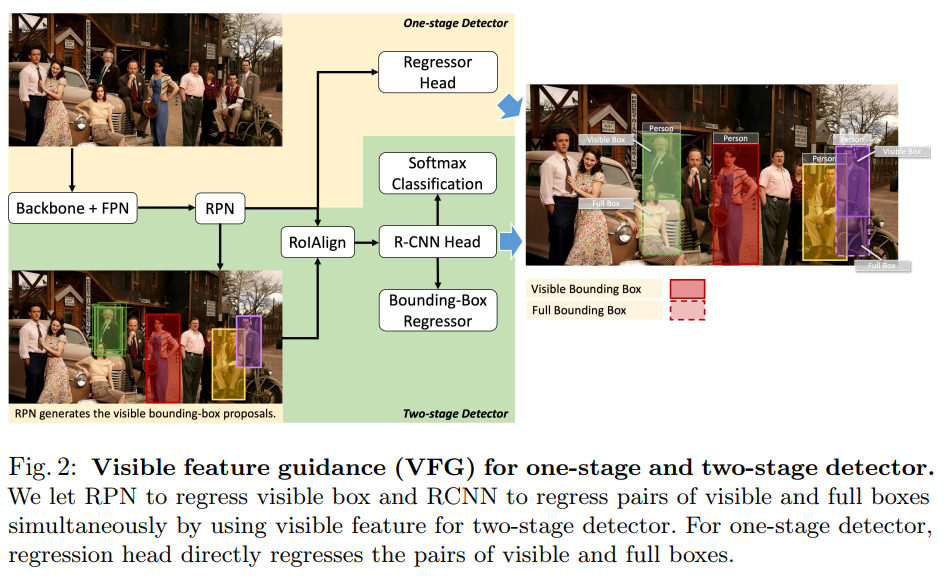
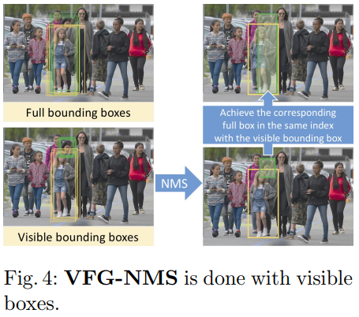
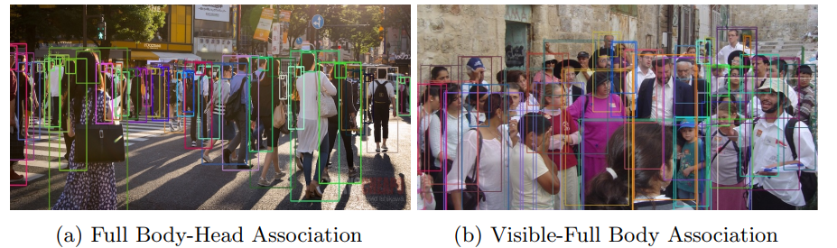

## Visible Feature Guidance for Crowd Pedestrian
阅读笔记 by **luo13**  
2020-8-27  

文章贡献：  
1、使用visible boxes信息更好地回归full boxes  
2、使用匈牙利算法组合同一实例的不同部件（感觉上有点凑字数）  
文章思路基本和representive region nms一样  

  
  
对于一阶段目标检测方法，直接回归出visible box和full box的边界，label assign使用visible box，对于二阶段的目标检测方法，RPN网络提取出visible box，之后回归visible box和full box。  

  
NMS只使用visible box

  
最后作者做了一个匈牙利算法组合同一实例部件的实验，有点莫名其妙  
[匈牙利算法介绍](https://zhuanlan.zhihu.com/p/96229700)

