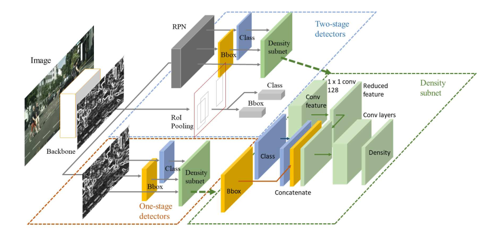
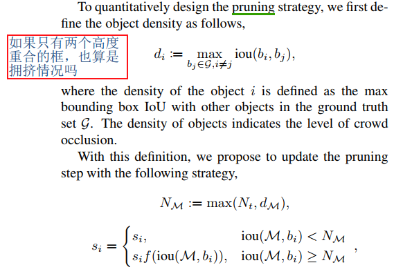
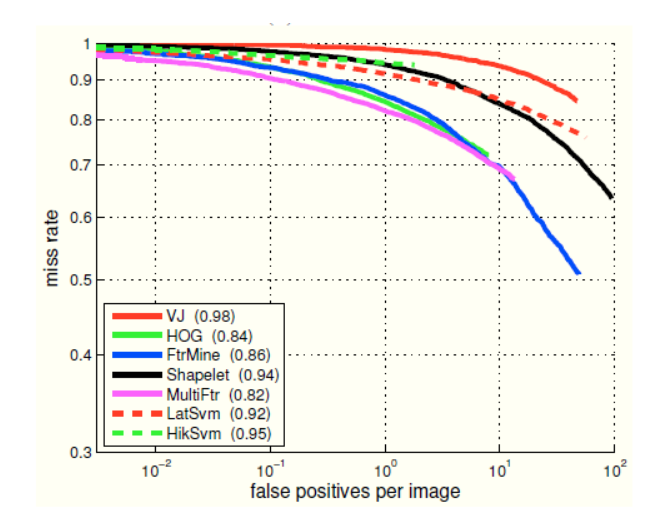

## Adaptive NMS: Refining Pedestrian Detection in a Crowd
阅读笔记 by **luo13**  
2020-8-6  

本文贡献：  
1、自适应NMS阈值  

  
  

通常两个物体高度重合的地方，需要一个较大的NMS阈值，重叠程度不高的地方则不需要太高的阈值。  

文章中对密度的定义是，当前目标框与其他目标框的最大的IOU得分，以此作为密度图的gt，让网络学习一个密度图，密度图的在推理的时候为自适应阈值提供密度值。

当选取一个预测框，进行NMS操作的时候，获取该预测框对应的密度值，根据密度值和预先设定的常量NMS阈值比对，之后进行其他预测框的分数得分重置。具体可以使用greedy NMS或者softer NMS  

思考：感觉这种选择最大值作为密度值的操作还比较合理，如果使用真正的密度图，如何整合周围的密度值呢  

  
  
绘制原理和ROC曲线差不多，当fppi越低，阈值越高，相应的miss rate也就越高了。通常可选[0.01, 1]之间的得分绘制MR-2图。  

