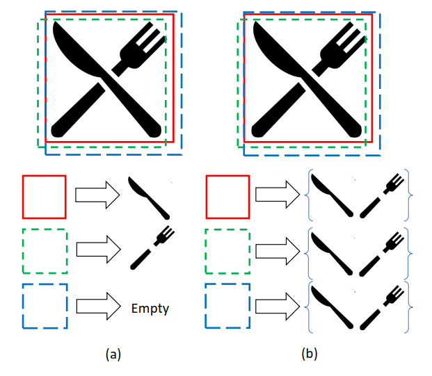
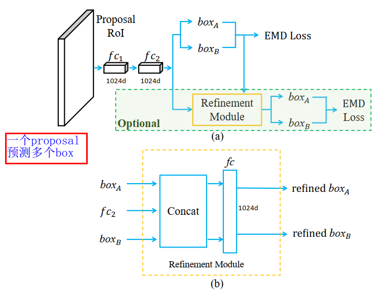
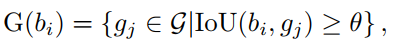
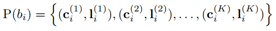
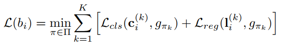
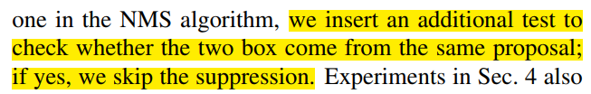
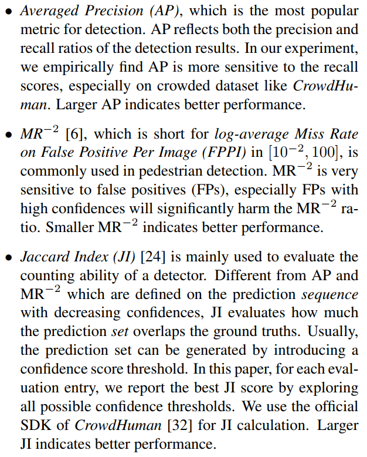
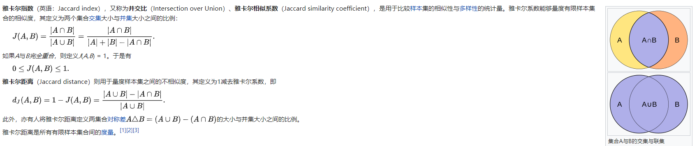

## Detection in Crowded Scenes: One Proposal, Multiple Predictions
阅读笔记 by **luo13**  
2020-8-24  

这篇论文通过增加一个proposal可以输出的预测框数目来改善高重叠度行人的检测情况。  
具体做法是从预测单个目标变成预测一个set  

   
a图中的情况在proposal之后的NMS就有被抑制的风险。而b图中被抑制也没有关系，因为每一个proposal之后都可以预测一个predictions set。  

   
主要改进是在RPN网络之后，使用一个proposal生成多个预测框。  
refinement模块是选择项，主要是用来防止预测多个预测框产生的false positive  
2个预测框是超参数  

   
   
   
loss是按顺序对比的，感觉不是最优选择  

   
最后进行NMS的时候，需要先判断是否来自于同一个proposal，如果是的话，就跳过NMS的步骤  

   
   
论文用到的评测指标  

疑惑：如何保证label assign时候的顺序一致性呢？（每一次重叠物体的set顺序问题）  
