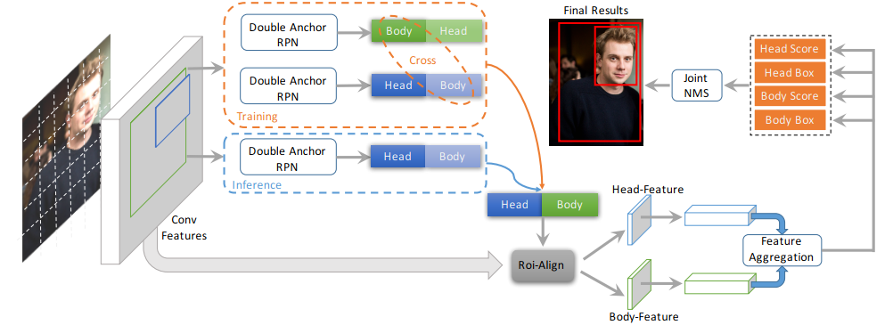
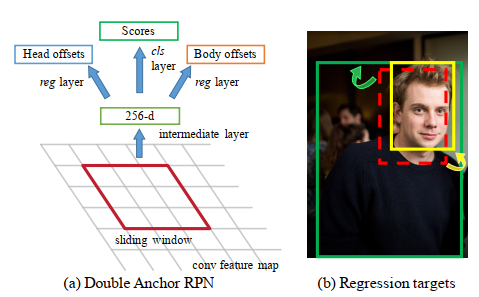
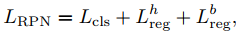
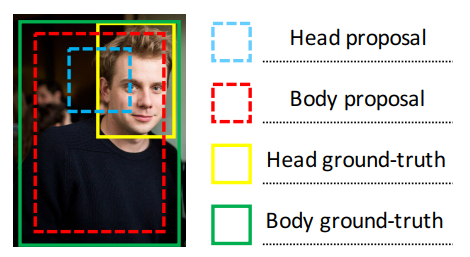
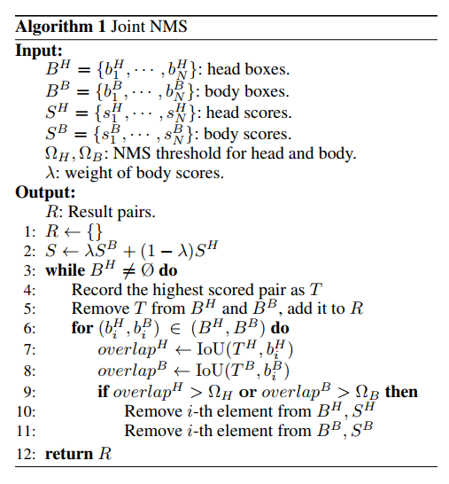

## Double Anchor R-CNN for Human Detection in a Crowd
阅读笔记 by **luo13**  
2020-8-12  

本文贡献：  
1、使用一个同时预测head和body
2、结合head和body特征，提升检测效果  
3、使用head和body得分改进NMS  

  
  
  
训练时会同时预测head和body，但是通常检测需要质量较好的anchor，而head-body分支分类label是使用head作为标准的，所以加入一条新的body-head分支，当head-body分支的body proposal与body-head分支的body proposal IoU大于阈值，即将head-body的body proposal替换成body-head的body proposal，应为body proposal的先验更好。每个分支只预测一个前后景得分  

后面的RCNN网络其实是head和body分开的，分类结果使用结合之后的FC特征同时预测，回归结果使用各自的featuremap分别预测，不知道回归分支的参数是否共用？

疑惑：如果其中有一个分支的得分阈值很低，但IoU很高，还需不需要替换呢？

  
proposal示意图  

  
nms得分使用head和body的得分加权  
