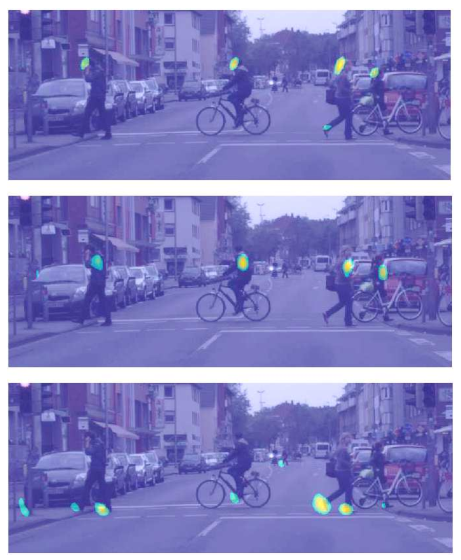
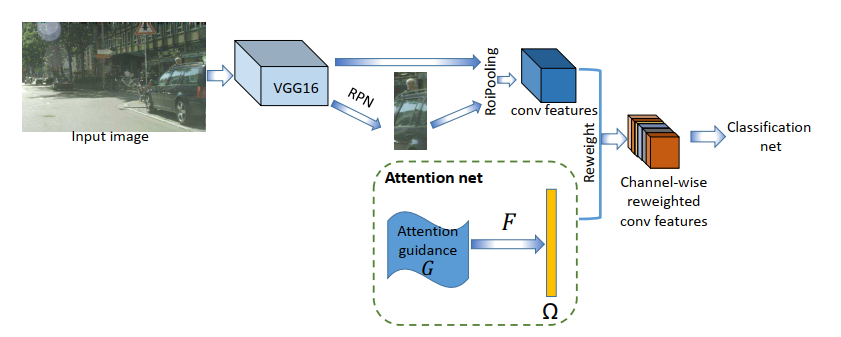
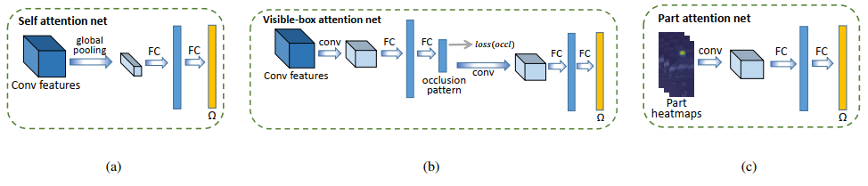
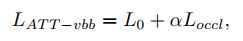

## Occluded Pedestrian Detection Through Guided Attention in CNNs
阅读笔记 by **luo13**  
2020-8-13  

  

本文贡献：  
1、分别实验了三种通道注意力模块对密集人群检测的效果  

缺点：  
1、注意力机制只加在了分类分支  
2、每个通道是否真的关注到人体某个部分  

  
网络结果加入了一个attention结构，只加在分类分支  

  
  

attention 模块有三个，a是自监督的，b是使用visible-box做监督，c是直接使用额外人体关键部位检测的网络提供的featuremap作为注意力机制。  
总体来说比较繁琐  

自监督方式借鉴SENet思想，采用backbone conv5_3的输出作为输入，经过图a的结构后得到一个注意力向量  

b的visible-box方式根据visible-box的情况分为full-visible、up-visible、left-visible和right-visible，使用ROI pooling之后的特征产生注意力向量，并使用中间层特征做分类监督，测试时能额外得到被遮挡的类别  

c是直接使用了额外的人体关键点匹配网络  

这篇论文的注意力机制感觉上比较复杂，增加的计算量感觉也比较多，而且motivation是否真的成立呢？
