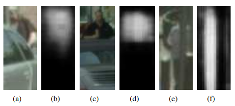

## Mask-Guided Attention Network for Occluded Pedestrian Detection
阅读笔记 by **luo13**  
2020-8-12  

  

本文贡献：  
1、使用visual mask增强可见部分的特征，使得网络能获取更过有助于分类的信息  
2、使用遮挡程度加强分类的损失  

  
在faster-rcnn结构上加入了MGA，用以加强visual部分的特征 

  
proposal中在visual box的即为1，在visual box外的为0，使用这一mask对RPN网络出来的特征图做深监督，得到的特征图再与原来的特征图做点乘运算，增强可见区域的特征  

  
加强后的特征  

  
  
  
mask loss是特征图上做BCE，occ loss是为了增大被遮挡实例的分类loss，使网络更加关注被遮挡的情况  

疑惑：感觉只增强了分类，但是对于回归没有做优化，这样对被遮挡实例回归full box会不会有影响  

