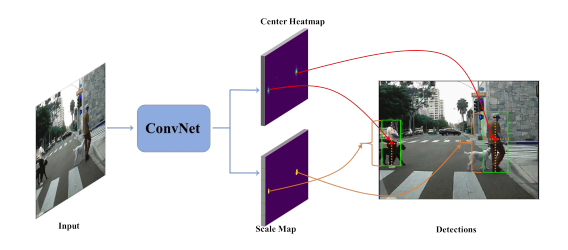
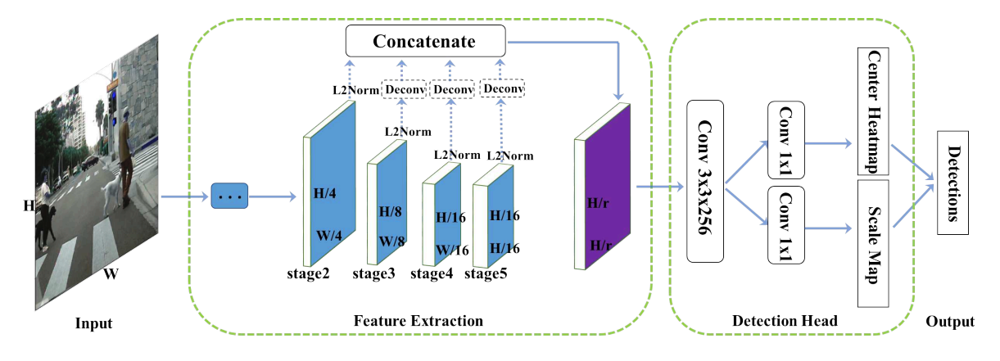
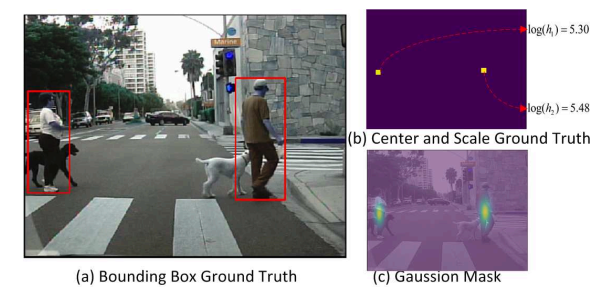
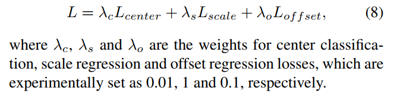
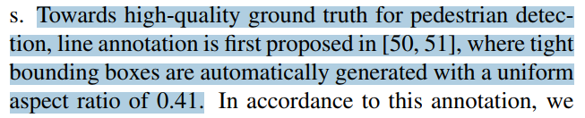
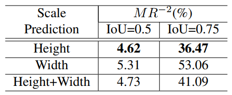
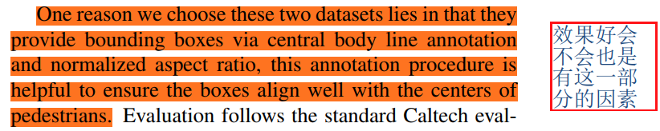

## High-level Semantic Feature Detection:A New Perspective for Pedestrian Detection
阅读笔记 by **luo13**  
2020-8-25  

本文贡献：  
1、使用anchor free框架预测行人位置  
2、不直接预测行人的长和宽，而是预测高度之后，通过预先设定的方式得到边界框  

  
主要分为两个部分，第一部分预测中心点，第二部分预测scale  

  
网络结构使用concat之后的featuremap去回归中心点位置以及scale，只用了一个长宽为原图四分之一的图片去预测而没有采用FPN结构  

  
GT使用log的形式，减小预测的难度  

  
loss由三部分组成，offset与cornerNet中的设定是一致的  

  
文章中使用高度作为scale，通过一个固定的比例得到宽度  

  
  
使用height作为scale的效果最好，这会不会和标注的方式有关系呢？
