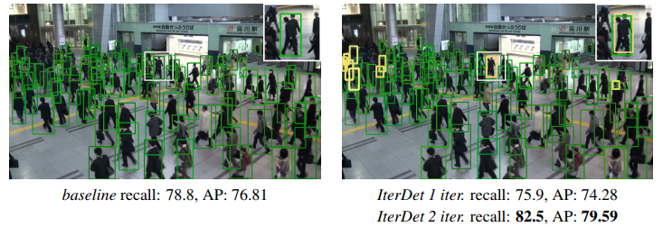
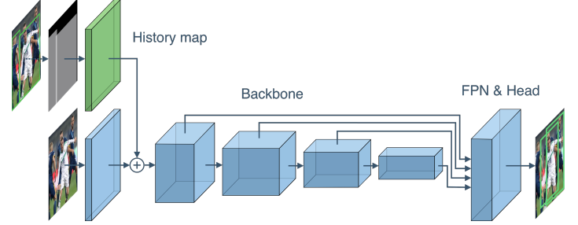
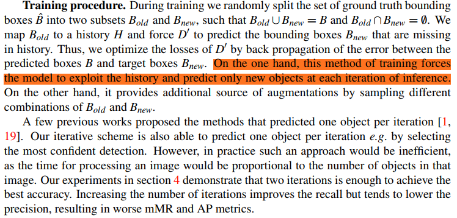

## IterDet: Iterative Scheme for Object Detection in Crowded Environments
阅读笔记 by **luo13**  
2020-8-25  

文章贡献：  
1、通过多次迭代预测出更多的预测框  
2、使用迭代策略训练  

  
  
第一次预测得出结果一，使用结果一生成一个history map。图片经过卷积层之后和history map经过卷积层之后concat之后再输入到backbone，进行第二次检测。

  
训练策略是每次训练随机把部分边界框当成已检测的边界框，这样可以让网络学习在部分目标已检测出来的情况下检测剩余的目标。  

小结：训练策略还是挺新颖的，但感觉总体上还是比较繁琐  
