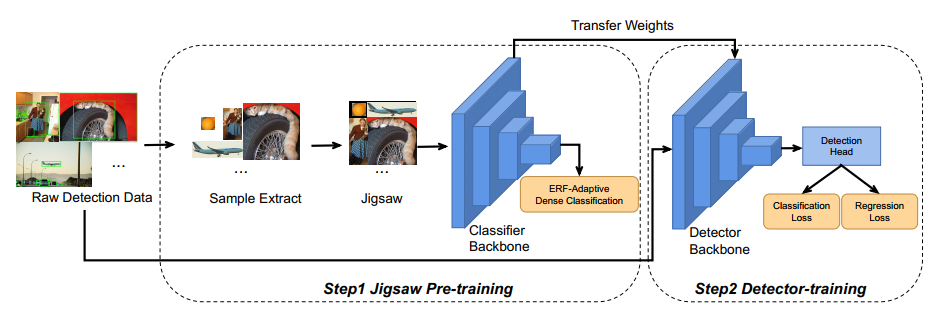
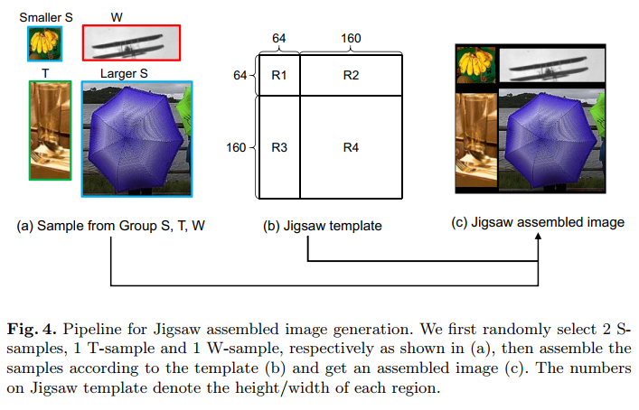
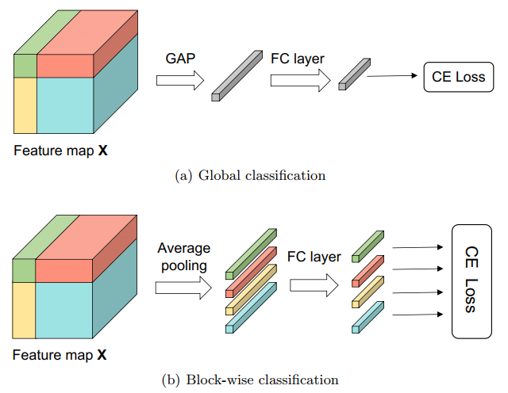
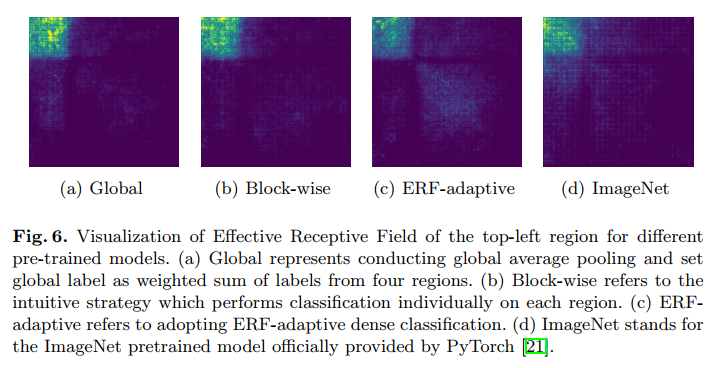
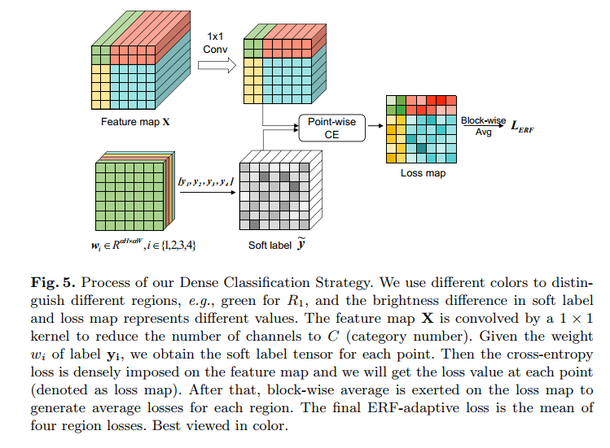
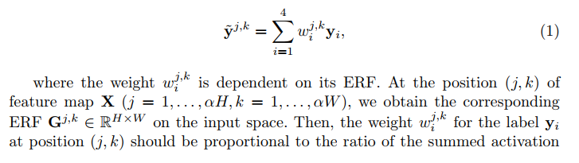
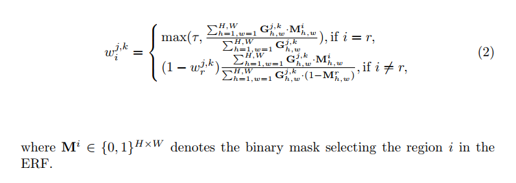

## Cheaper Pre-training Lunch: An Efficient Paradigm for Object Detection
阅读笔记 by **luo13**  
2020-9-1  

文章贡献：  
1、文章提出了一种新的目标检测预训练方法  
2、针对感受野不足的问题，提出ERF LOSS

  
整体流程和正常的预训练是一致的  

  
图片整合使用jigsaw的拼图方式，拼图实例从训练集中裁剪出来，并且按照长宽比和大小分类。  

  
作者一开始提出两种分类方式，第一个是像cutmix一样整合多个类别到同一个标签，另一个是针对不同的分块做分类损失

  
但前面的两种方式会导致每一个block的感受野只局限于当前block区域，这会影响到目标检测的性能  

  
  
  
作者提出的ERFloss结合了感受野的信息，每一个点都结合了全部block的信息，从而显示地增大了感受野
（但这里的G不知道是怎么得到的，文章也没有介绍）

