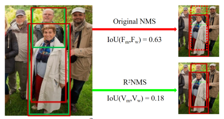

## NMS by Representative Region: Towards Crowded Pedestrian Detection by Proposal Pairing
阅读笔记 by **luo13**  
2020-8-5  

这是一篇针对密集人群NMS的论文，文章测评使用full box

本文贡献：  
1、提出pair-RPN和pair proposal feature extractor，更好地整合pair boxes的信息  
2、结合visual box改进NMS

  
在普通NMS中，full boxes通常会有较大的IoU，这在进行NMS的时候，有较大几率会抑制true positive。但是不同人的visual boxes的IoU通常较小。故作者提出，使用visual boxes进行NMS操作。  

  
网络主要分为三个部分，特征提取，paired RPN，ppfe和p-rcnn

  
  
只要某个anchor与viusal box gt和full box gt重合度都高于阈值，才会被认为是正样本，预测值是2个边界框的信息以及，两个框属于同一个人的概率（这里的概率有点奇怪，不是只有一种情况吗？好像没有不属于同一个人的情况）

  
中间的attention应该是以full box为准的，论文没写清楚

  
和proposal的标签一样，也是要同时符合两个gt  

  
NMS使用的是visual boxes的IoU，通常visual boxes IoU较大的是同一个人，较小的是不同人。  

结论：使用visual boxes的确能较好的解决重叠问题，但这要建立在同一个anchor能预测到同一个人visual box和full box的基础上，其次数据的标注也需要有相应的格式  

