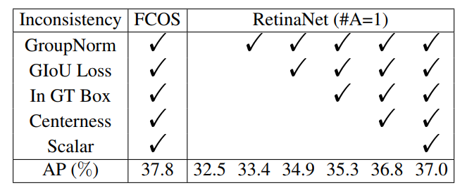
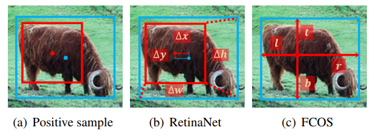
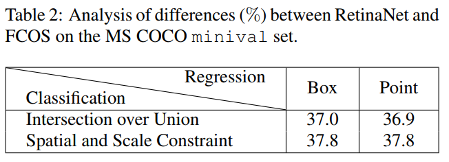
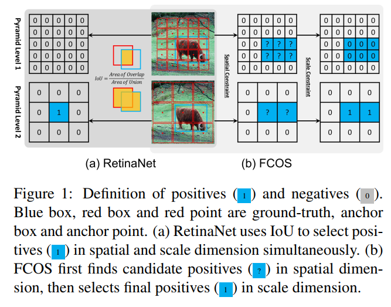
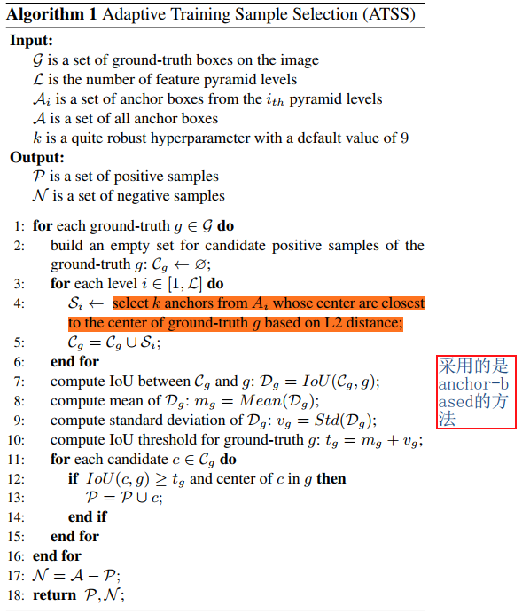
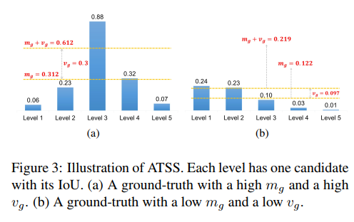
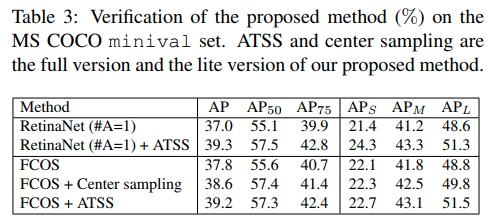

## Bridging the Gap Between Anchor-based and Anchor-free Detection via Adaptive Training Sample Selection
阅读笔记 by **luo13**  
2020-5-3  

这篇论文提出了一个自适应正负样本分配策略，文章对FCOS和RetinaNet为什么会存在差异，进行了详细的分析，最后得出，差距存在的地方在于正负样本分配的问题上。  

本文贡献：  
1、采用FCOS和RetinaNet，探讨了anchor-based和anchor-free方法存在差异的原因。  
2、提出了一个正负样本分配策略。  

  
为了找出FCOS和RetinaNet的主要差别，作者先将RetinaNet每个锚点的anchor数目设置为1，然后将FCOS中使用的技巧都补充上，最后发现RetinaNet和FCOS还是存在0.8的差距。  

消除了前面的差异之后，两个算法不同的地方就只剩下了label assign以及边界框的回归方式。  

  
  
作者通过对比实验，发现采用相同的label assign时，两个的结果差距并不大，问题可能出现在了label assign的方法上。  

  
这里作者也只是说明了这是他们label assign方法不同所造成的差异，但为什么FCOS的分配策略会比较好，没有给出一个合理的解释。（但似乎通过IoU来分配正负样本并不是很合理）  

  
  
  
ATSS首先每个层选K个最靠近GT中心点的锚点，然后将他们的先验框与GT算IoU，得出均值和方差，大于均值加方差的，又在GT内的，即可被分配为正样本。高的方差说明可能只有一个层是适合这个GT的，低的方差说明可能有多个层适合这个GT。值得说明的是，给anchor-free的方法假设一个锚点先验框，就可以把ATSS也用在anchor-free的方法上。  

小结：文章的分析做得很好，看起来很舒服，但是最后的ATSS其实不是自适应的，因为可以发现，其实这个均值和方差在训练的过程中并不会发生变化。

