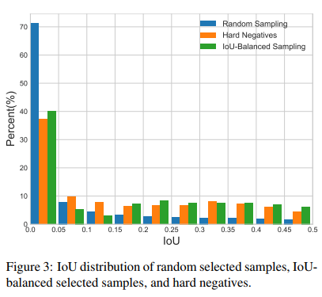
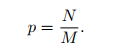
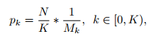
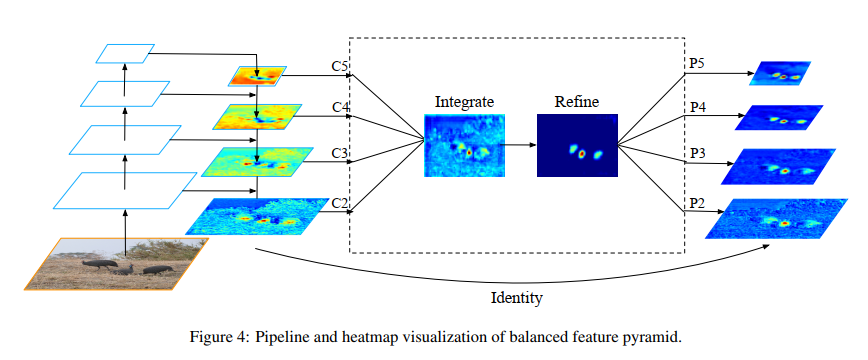
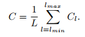
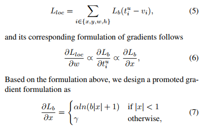
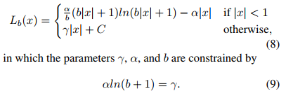
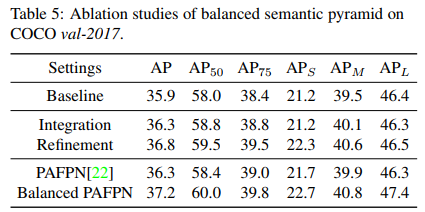

## Libra R-CNN: Towards Balanced Learning for Object Detection
阅读笔记 by **luo13**  
2020-7-19  

文章从正负样本均衡、特征金字塔均衡和多任务损失均衡三个方面对目标检测器进行了改进，该方法适合一阶段和两阶段的检测算法  

文章贡献：  
1、提出了以IoU为区间的负样本均匀采用方式  
2、提出了平衡特征金字塔，能与现有的FPN结构相融合  
3、提出了平衡的回归loss

  
文章从正负样本平衡、金字塔信息平衡、损失平衡三个方面进行改进  

  
  
  
作者做了一个困难负样本与随机采样的负样本IoU分布实验，这里文章里没有说困难负样本是如何确定的。实验发现，有60%的困难负样本与正样本的IoU大于0.05，而随机采样只有30%的负样本阈值大于0.05，这说明，随机采样会产生大量的简单样本，这会加剧类别不平衡问题。改进方式，将负样本基于IoU划分为不同的区间，每个区间的采样数量是根据该区间的负样本数目确定的，这样能加大采样结果中困难负样本的比例。  

  
  
特征融合的改进是，先concat，再得出每个FPN的特征层，这一方法可以与其他的FPN结构相结合。  

  
  
作者认为目标检测框架中分类loss和回归loss很难取得平衡，其中一个原因是回归loss的梯度往往大于分类loss产生的梯度。作者直接从梯度出发，先将回归损失中产生的大于阈值的梯度限制在一个常值，然后通过梯度公式反推回去损失函数  

  
平衡特征层的消融实验  
