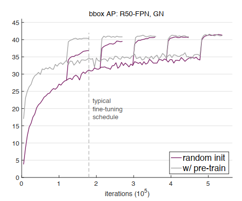
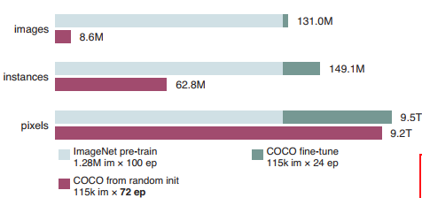
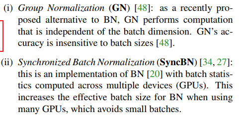
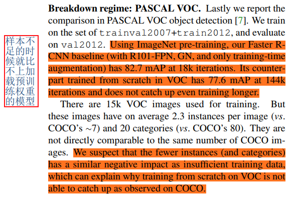

## Rethinking ImageNet Pre-training
阅读笔记 by **luo13**  
2020-5-17  

这篇论文证明了目标检测在重头开始训练的效果与使用预训练权重，在某些环境下可以达到相同的效果。  

为了达到相同的效果，需要满足以下的条件。  
1、使用GN或者SyncBN（或者其他可以减小批量大小带来影响的归一化方法）  
2、更多的迭代，使得重新训练的模型与使用预训练权重的模型经过差不多的计算量  
3、使用合适的初始化方法（文章里面提到的是MSRA）  

   
随着迭代次数的增加，效果趋于一致  

  
作者认为迭代更多次数的原因在于图片数和实例数远低于使用预训练权重所接触的到图片数目和实例数据。（只有pixel是大概相同的，因为分类预训练模型的图片通常比较小）  

  
可以减少batch size带来的影响的归一化方法  

  
VOC数据量较少，重新训练还是不能与加载了预训练模型的效果相比，这里作者也没有否认预训练在数据较少情况下带来的明显收益。  
