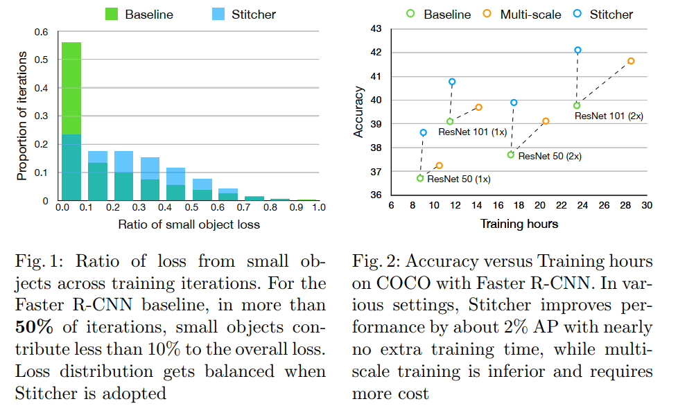
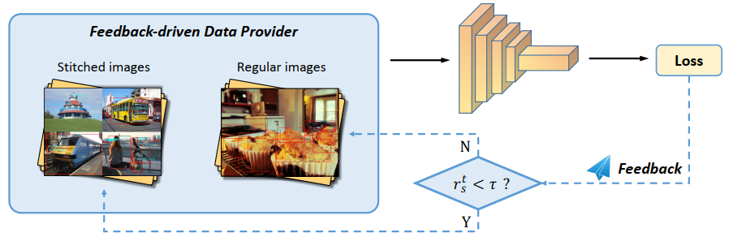
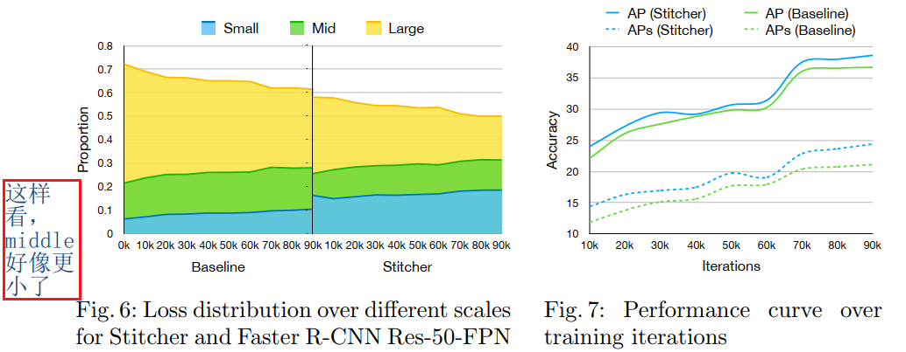

## Stitcher: Feedback-driven Data Provider for Object Detection
阅读笔记 by **luo13**  
2020-5-3  

这篇文章提出了一个简单有效的数据增强方法  

  
  
  
  

这篇文章的做法一定程度上解决了tinyperson中不能改变相对尺寸的问题。思想其实很简单，按照一定的规则计算出小样本在每轮迭代中的比例，如果比例小于阈值的话，则在下一轮输入裁剪缝合的图片。从上图中也能看出缝合之后小样本的loss贡献比例加大，最后效果也得到了提升。好像yolov4也用到了相应的技巧。    

