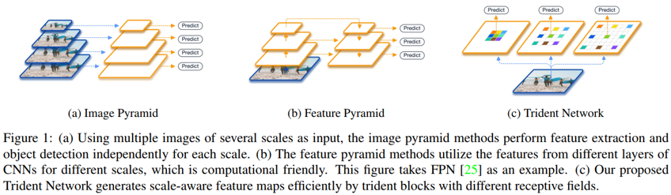

## Scale-Aware Trident Networks for Object Detection
阅读笔记 by **luo13**  
2020-3-3  

Scale-aware trident Network，这一篇论文从尺度变化的角度优化目标检测算法，作者总结了目前主流的解决尺度变化的两种方法。  

  

第一种是直接使用不同尺度的图片作为输入，这样的缺点是计算量太大。第二种是一种折中的方法，使用的是特征图的尺度变化，减少了计算量，但是作者认为不同特征层的预测结果是通过不同参数计算得出的，这会让网络不那么鲁邦，个人理解是相当于用多种方式去拟合不同的尺度，会增加学习的复杂度，且带来不稳定性。所以作者提出了一个使用单一网络的方法，用相同的参数去学习不一样的尺度，使用空洞卷积，共享不同分支的参数，但是达到解决不同尺度的问题。该方法在COCO数据集上达到了SOTA。  

**感受野实验**  
作者一开始做了一个关于感受野的实验，探究了感受野对目标检测的作用。（实验很重要）  
  

**网络结构**  
  
作者提出了一个权值共享但是感受野不同的结构，这样就可以让同一套参数学习到不一样的特征，训练的时候每个分支只负责相应尺度大小的proposal和gt，测试的时候如果使用三个分支计算量比较大，作者说只是用中间的分支也可以取得比较好的结果。

**Trident block**  
  
文章好像只说在最后是用到了这个block  

**消融实验**  
  
如果不使用权值共享，好像本文提出来的训练策略效果就没有很有用，总感觉权值共享才是最重要的。

小结：个人感觉作者给出的理由其实是比较感性的，对于特征金字塔的缺点其实我不是很确定作者的说法是否正确，但是从作者给出的实验结果来看，本文的方法是更优的方法，而且计算量也相应的减少了。值得学习的地方是，作者的切入点很好，别人都是想着不同参数解决不同尺度，作者是要相同参数解决不同尺度，而且这是最近少有的从感受野方面去优化目标检测算法的论文。这一切入点可能也是一时的灵感，灵感很重要，但是通过实验能证明这一灵感的正确性从而提出优化方法也很重要。

