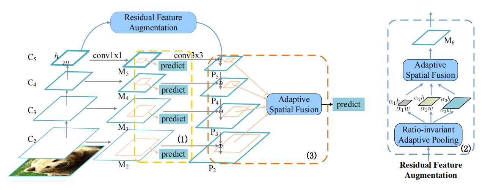
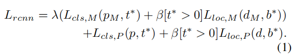
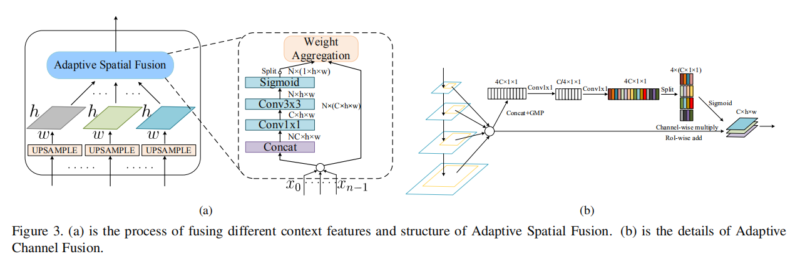

## AugFPN: Improving Multi-scale Feature Learning for Object Detection
阅读笔记 by **luo13**  
2020-7-3  

文章里面主要介绍的是二阶段的方法，但作者说augfpn也可以整合到一阶段的方法中，具体没有详细看。  

文章贡献：  
1、改进了FPN结构，使得分辨率最低的一层不至于丢失太多信息  
2、采用深度监督的方式加强fpn的学习能力  
3、预测的时候参考SENet对不同层的特征做了加权融合  

  
采用RFA结构减轻最后一层特征损失的情况，RFA首先通过比例不变的pooling，将特征图pooling成三个不同尺度的特征图，再通过ASF进行权重加权得到最后的特征图并与最后一层做融合。  

  
深度监督指的是，作者认为P层融合之后的特征不能很好的代表各个尺度信息，所以在M层采用了深度监督，预测头和分类头在各个层上是权值共享的，这样有利于不同层学习相同的语义信息，但这里好像跟最后的预测不一致，因为最后的预测会先融合不同的层。  

  
ASF参考了SENet的结构，相当于给每个通道重新分配了权值，而且作者从每个层都提取RoI，形成了一个soft RoI selection   
