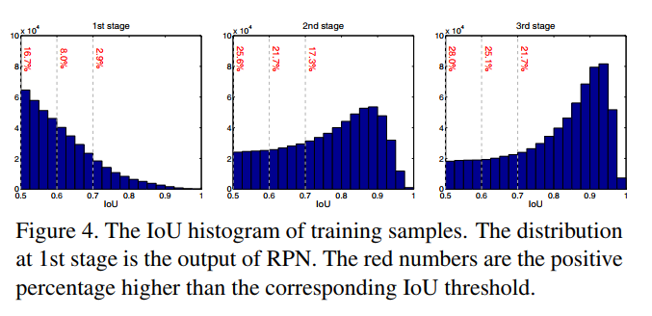
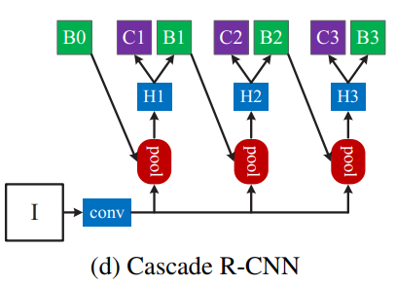

## Cascade R-CNN: Delving into High Quality Object Detection
阅读笔记 by **luo13**  
2020-3-3  

这篇论文作者提出了两个很有参考价值的问题，一个是因为少样本而导致过拟合的问题，另一个是作者提出的训练iou与与测试iou的mismatch问题。第一个比较好理解，当训练时候设定的正样本IOU越大，这时候的正样本就会越少，从而导致过拟合的问题。第二个是作者发现如果使用iou=a的阈值进行正负样本区分，这样训练出来的模型对于region proposal iou=a的边界框可以回归得很好，而对于其他iou的边界框回归效果就会变差。所以作者提出了一个联级RCNN用于解决这一问题。  

**少样本过拟合问题**  
  
第一个图是region proposal出来之后的样本分布情况，IoU越高，样本越少。这样高阈值的时候就容易导致过拟合。  

**mismatch**  
这是mismatch的问题，用哪个阈值训练，输入iou和训练iou相同时优化效果最好。优化效果最好指的是增益最大。  

**网络结构**  
  
这是作者提出来的联级结构，因为没有看过源代码，文章的解释也不是很详细，个人理解是，B0提出region proposal，经过H1进行一次回归，B1选出部分正样本负样本进行训练，同时将经过H1回归的所有proposal输入到H2，使用新的更高得到iou选取正负样本训练B2，H3、B3也是这样重复。从而使高阈值的正样本逐渐增多，缓解了高IoU阈值样本较少的问题，并且因为每个部分负责不同IOU阈值的边框回归，缓解了mismatch的问题，从而提升了整体的效果。  

小结：IOU的mismatch问题比较有参考价值，但这个问题一定要使用联级结构去解决吗？

