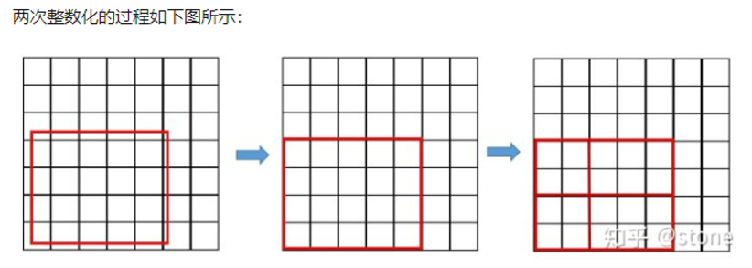
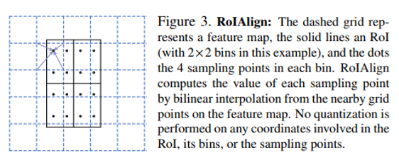
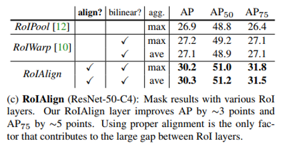

## Mask R-CNN
阅读笔记 by **luo13**  
2020-3-3  

Mask-RCNN，之前一直在关注一阶段的目标检测方法，但后面返现RPN网络的应用还是非常广泛的，所以挑了两篇比较经典的二阶段论文进行学习。Mask-rcnn有两个比较重要的创新点，一个是加入mask分支使网络可以解决语义分割的问题，第二个是从语义分割的实验中发现了roi不对齐的情况，从而提出了RoIAlign。首先是mask分支，作者尝试了几种结构，不在这里展开了，主要的一点是作者尝试了类间的解耦，训练的时候输出的mask是一个K\*m*m的heatmap，使用sigmoid函数对K个类别做二分类，并且只选取真实类别的层算入损失。**预测的时候根据分类层的结果直接挑选对应的第k个mask作为mask的结果**。作者对比了使用softmax函数，sigmiod作分类函数的结果要好于softmax，而这可能得益于类间的解耦。感觉这个好像解释了为什么上周菜品分类实验中sigmoid做损失函数结果要好于softmax。第二部分是解决了RoI的对齐问题，在faster-rcnn中有两个整数化的地方，1、region proposal的xywh通常是小数，但是为了方便操作会把它整数化。
2、将整数化后的边界区域平均分割成 k x k 个单元，对每一个单元的边界进行整数化。（如果提取出region proposal之后还进行了下采样，则保存了下采样可能带来的精度损失）  

**整数化**  
  

**RoIAlign**  
  
具体的做法就是一直用小数的形式存储下来，通过双线性插值的方法计算每个方格内多个点的像素，再对这些值取均值（或者最大值）得到每个方格的像素值，这样可以使分割的mask效果得到比较大的提升。（但是mask位置方面会不会存在偏移呢？）  

**消融实验**  
  
作者对RoIAlign做了消融实验，可以看出还是很优秀的  

小结：分类也可以使用解耦的思想，多类之间不一定会存在关系。网络处理过程中的整数化，特别是边界框的整数化问题会带来精度上的损失。
