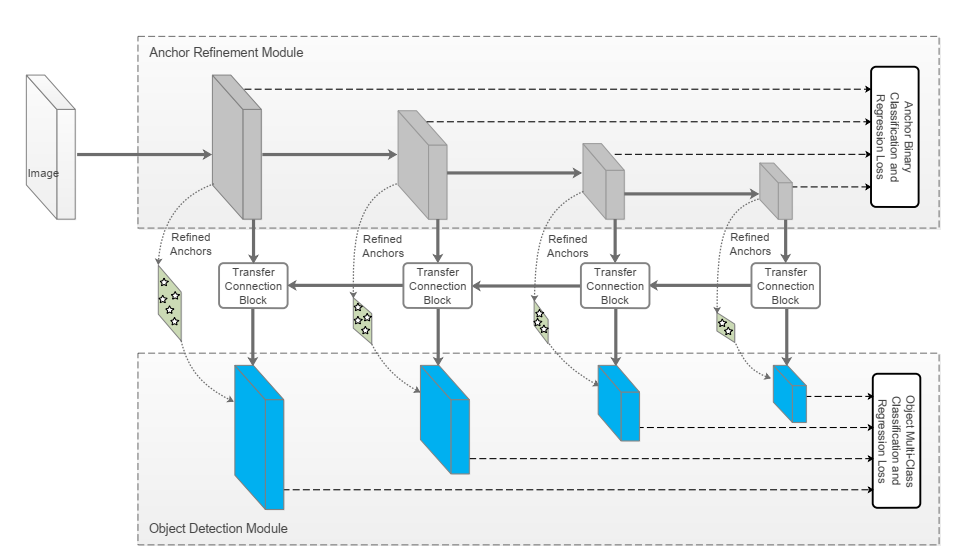
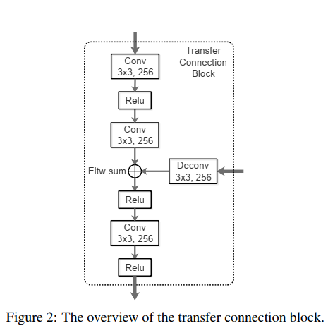
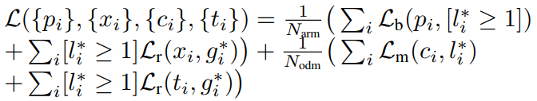
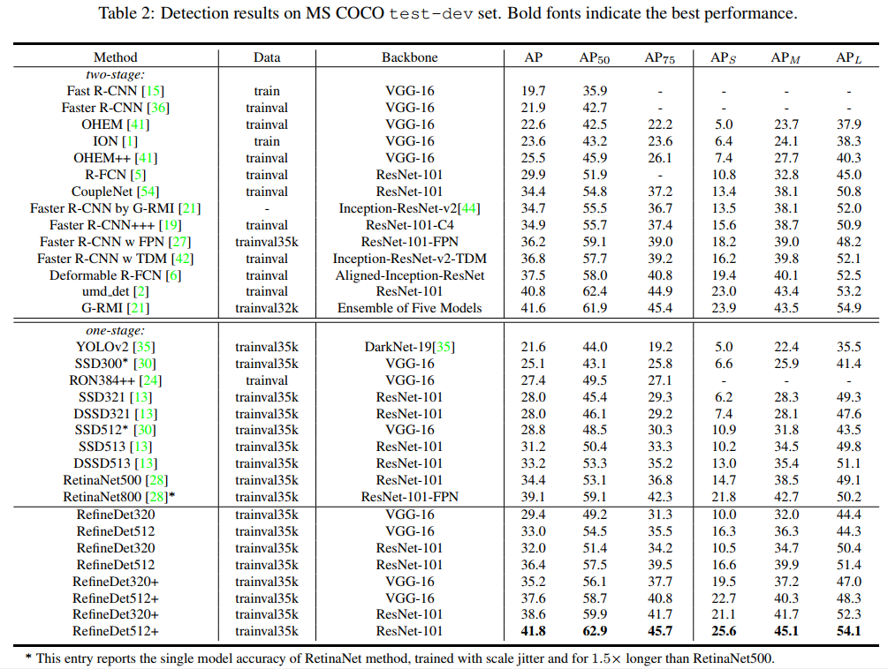
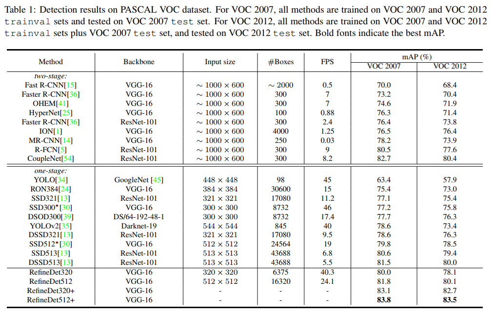
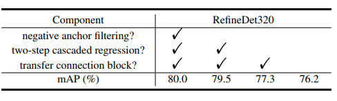

## Single-Shot Refinement Neural Network for Object Detection
阅读笔记 by **luo13**
&nbsp;  
**个人感觉**  
感觉第一部分就是一个RPN网络。  
&nbsp;  
**网络结构图**  
&nbsp;  
  
Backbone Network采用RPN网络，预测方式与SSD相类似，每个scale的feature map都会进行预测。不同的是，在文中Anchor Refinement Module中对prior anchor boxes进行了一次回归，选取IOU大于阈值的anchor boxes输入到下一阶段的Obejet Detection Module中，同时剔除了置信度较高的负样本框，从了减少了负样本框的数量。同时为了融合ARM和ODM中相应的特征层，加入了TCB模块。  
&nbsp;  
  
TCB模块  
&nbsp;  
**LOSS**  
 
LOSS为两个模块的损失之和。  
&nbsp;  
**Anchors Design and Matching**  
在ARM中，每个ground truth只和IOU最高的Anchor Box配对，在ODM中，进行过一次回归的Anchor Box只和与ground truth IOU大于0.5的配对。
&nbsp;  
**Inference**
ARM去掉一批置信度较低的Anchor Boxes，ODM输出大约400最高置信度的检测框  
&nbsp;  
**效果**  
   
  
  
&nbsp;  
**疑惑**  
二阶段的检测方法难道不会在第二阶段的时候回归出一个更差的结果，导致bbox变成负样本？  
&nbsp;  
这里的ODM还是存在负样本的，为什么LOSS中没有判断是否是物体的损失？
