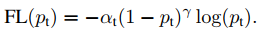
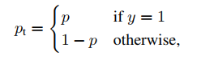
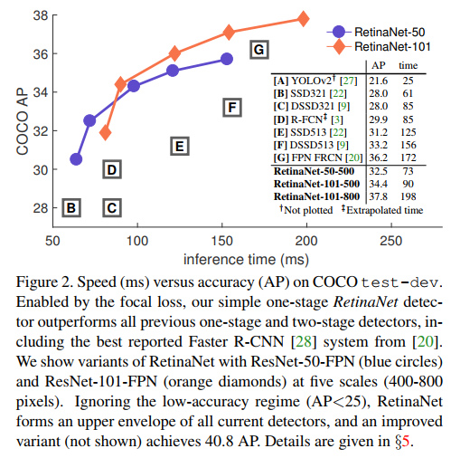
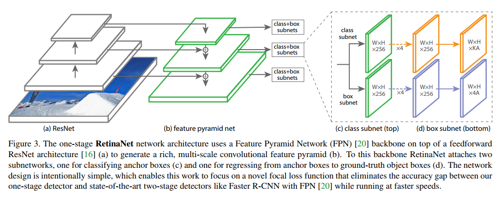

## Focal Loss for Dense Object Detection
阅读笔记 by **luo13**  

**总结**  
提出Focal loss解决正负样本类别不平衡问题，提出以FPN为backbone的一阶段检测网络。  

**motivation**  
在一阶段目标检测方法中，负样本会比正样本多出很多，这会使得训练过程中正样本的损失会被负样本带来的损失所覆盖。为了解决这样的问题，已经提出了很多的解决类别不平衡问题的方法，如OHEM。本文提出一个改进的交叉熵损失来解决这一问题。  

**Focal loss**  
  
$p_t$是类别概率。  
  
$\gamma$是一个大于等于0的数，$\gamma=0$就是交叉熵损失。  
加入$\alpha$的原因是作为给每个类别加上一个先验值，实验效果会更加好。  
使用Focal loss收敛也会更快，归一化使用的是正样本的数量，防止因为负样本太多导致概率趋近于零。  
需要注意的是，在刚开始训练的是，网络可能会五五开的分类，导致正负样本概率都差不多，为了使focal loss更好地发挥作用，在将最后一层网络的b初始化为$-\log((1-\pi)/ \pi)$,$\pi=0.01$，这样会使全部样本在训练初期的概率都为0.01，增强了正样本的作用，削弱了负样本的作用。  

**Focal loss result**  
 

**RrtainNet**  
   
backbone使用了FPN结构，不同scale的feature map分别做预测，融合了上下文的信息，分类子网络和回归子网络结构基本一样，但是参数是不共享的。  
