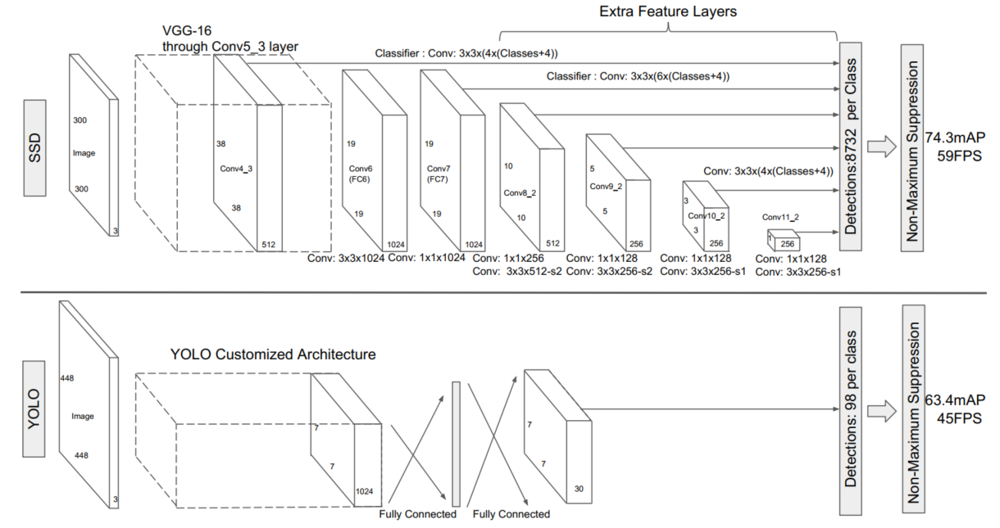
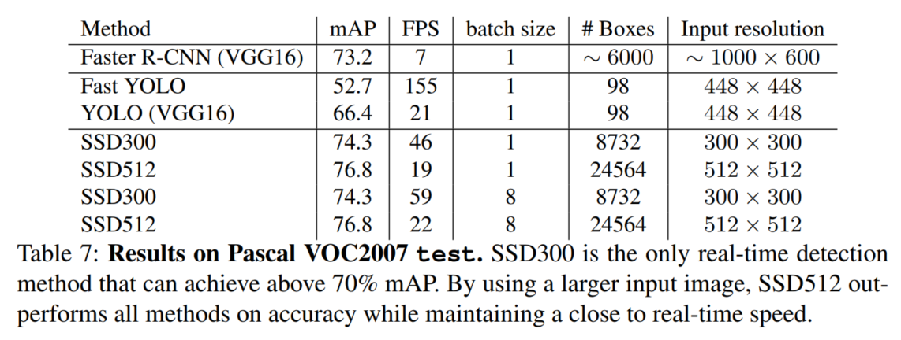
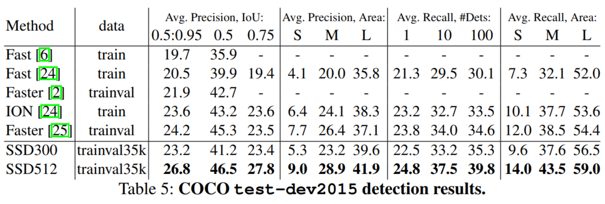

## SSD:Single Shot MultiBox Detector
阅读笔记 by **luo13**

### 网络结构
  
SSD的输入图像大小是$300\times300$，图中每个anchor输出四个检测框，最后输出预测框数目是8732个
### 模型优点
1. 是一个端到端的系统，速度比YOLO快，精度比Faster-RCNN快
2. 使用了更多更小的卷积核
3. 融合不同尺寸的feature map，实现多尺寸预测
4. 使用了neg:pos=3:1的Hard negative mining

### 模型缺点 #TODO

### 损失函数
采用的损失是置信度误差和定位误差的一个加权和  
$$L(x,c,l,g)=\frac{1}{N}(L_{conf}{x,c}+{\alpha}L_{loc}(x,l,g))$$  
定位误差使用L1误差  
${(cx,cy)}$是default bounding box的中心点，${w,h}$是default bounding box的长和高，${x_{ij}^{p}=\{1,0\}}$代表第i个设定框在第p个类别是否和第j个ground truth框相匹配，其中$\sum_ix_{ij}^{p}\geq1$，因为有可能多个预测框对应一个ground truth   
$${L_{loc}(x,l,g)=\sum\limits_{i\in Pos}^{N}\sum\limits_{m\in{cx,cy,w,h}}x_{ij}^{k}}smooth_{L1}(l_i^m-\hat g_i^m)$$  
$$\hat g_j^{cx}=(g_j^{cx}-d_i^{cx})/d_i^{w} \quad \hat g_j^{cy}=(g_j^{cy}-d_i^{cy})/d_i^{h}$$  
$$\hat g_j^{w}=\log(\frac{g_j^{w}}{d_i^{w}}) \quad \hat g_j^{h}=\log(\frac{g_j^{h}}{d_i^{h}})$$  
置信度损失  
$${L_{conf}(x,c)=-\sum\limits_{i\in Pos}^Nx_{ij}^p\log(\hat c_i^p)-\sum\limits_{i \in Neg}\log(\hat c_i^0)} \quad {where \quad \hat c_i^p=\frac{\exp(c_i^p)}{\sum_p\exp(c_i^p)}}$$  
$$\hat c_i^0=\frac{\exp(c_i^0)}{\sum_p\exp(c_i^0)} \quad c_i^0代表是背景的概率$$  

### 实验细节
**Choosing scales and aspect ratios for default boxes**
$$s_k=s_{min}+\frac{s_{max}-s_{min}}{m-1}(k-1)$$
${s_{min}=0.2},{s_{max}=0.9}$，所以lowest layer的scale是0.2，highest layer的scale是0.9。对于每个scale有5个non-square aspect ratios：$a_r\in\{1,2,3,\frac{1}{2},\frac{1}{3}\},(w_k^a=s_k\sqrt{a_r}),(h_k^a=s_k/\sqrt{a_r})$，对于aspect ratio=1的square bounding box，长宽${s'_k=\sqrt{s_ks_k+1}\lt1}$  
这是预测6个bboxes，预测4个bboxes的时候去掉$3,\frac{1}{3}$

### 性能指标
**Pascal VOC2007**
  
**COCO**

### 疑问
