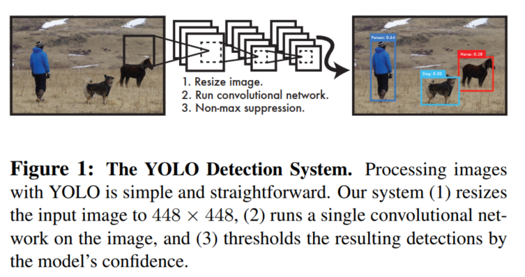
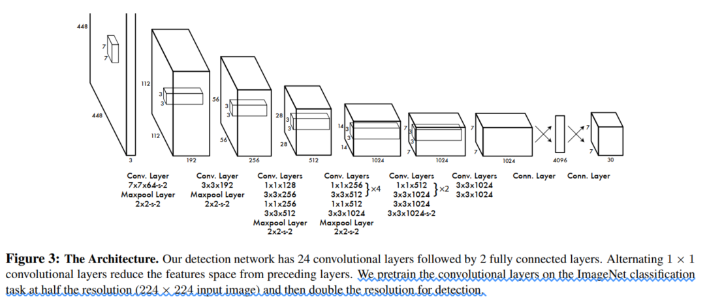
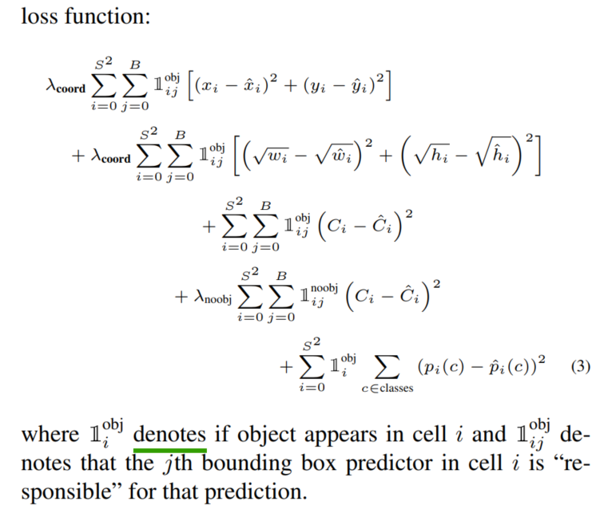
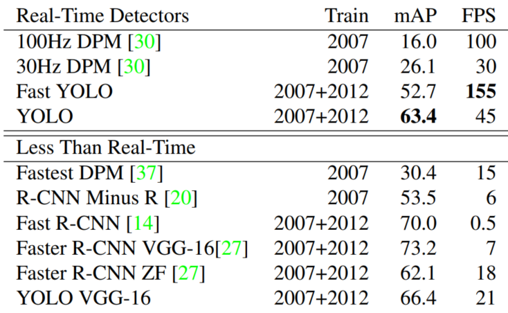

## YOU ONLY LOOK ONCE: Unified, Real-Time Object Detection
阅读笔记 by **luo13**

### 网络结构

**流程图**  
  

**网络结构图**  

### 模型优点
1. 模型是一个整体的结构，不再像R-CNN系列那样需要RPN网络，而是直接预测x, y, w, h, p(x, y是相对与网格左上角坐标的偏移量, w, h是相对于全图的大小)
2. 计算量比较少，预测的bboxes较少
3. 使用了全局信息，所以相对于R-CNN系列减少了对背景的误检测，但是这个个人觉得跟预测bboxes较少也是有一定关系的
4. 因为模型是一个整体的结构，可以实现端到端的训练
5. 快，主要原因是前面第一、第二点

### 模型缺点 #TODO
1. 预测框太少，对于密集的目标检测效果不好
2. 难以预测新目标或者不常见的目标（应该是目标检测都会有的问题）
3. 损失函数的构建上存在问题，比如对较大检测框的误差和较小检测框的误差相同对待（假设在H上的误差都是${\triangle}$，显然在小检测框上的惩罚应该更大）

### 损失函数
  
coordinate loss只计算那些存在物体且IOU最高的检测框，且${\lambda_{coord}}$=5  
object loss分别计算那些存在物体且IOU最高的检测框以及不存在物体的检测框，且${\lambda_{noobj}}$=0.5    
class loss只计算那些存在物体且IOU最高的检测框  
与GT的IOU最大的预测框为"resposible"的预测框  

### 实验细节 #TODO
1. 预测的时候会预测7*7*2=98个预测框  

### 性能指标
**Real-Time Systems on PASCAL VOC 2007**  

### 疑问
1. 为什么是物体中心所在的grid负责去检测该物体，物体中心所在的grid附近的gird感觉也可以做到该物体的检测？  
   因为GT是中心对称的，它的中心只能在相应的grid内。其他的grid是不可能完全拟合GT的。  
2. 究竟是哪个anchor box复杂GT的预测？    
   GT中心所在的grid cell的anchor boxes复杂预测该GT，具体是哪个anchor box去负责GT的预测，则需要比对他们的IOU，IOU最大的则负责预测该GT，其他的anchor boxes不与该GT匹配。  
3. 怎么将anchor和ground truth相匹配上
   