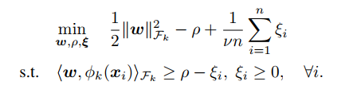
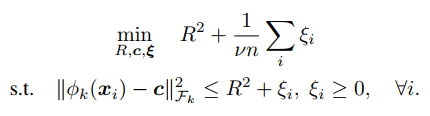
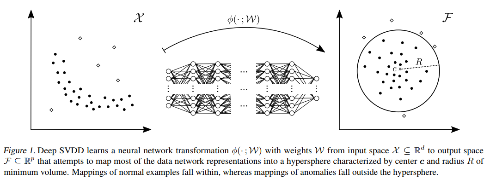
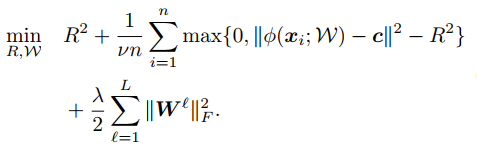
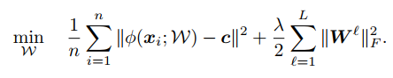
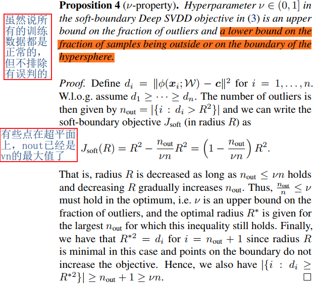

## Deep One-Class Classification
阅读笔记 by **luo13**  
2020-5-10  

one class SVM是异常检测中比较常见的一种方法，在异常检测中，异常样本通常是不可获得的，这导致了我们只能使用正常样本去构建分类器，主要思想就是，怎么提取正常样本的属性，以及怎么将其与其他的未知的异常样本分离开来。  

本文贡献：  
1、将one class SVM与深度学习结合起来  
2、解释了one class loss中的参数含义，以及介绍了应该如何构建网络。  

  
one class SVM的目标是找到一个超平面，使正常样本和原点尽可能分离开来，这里其实挺疑惑的，虽然远离了原点，但原点数据就代表了异常数据吗？

  
这是改进后的one-class-svm，优化目标是使正常数据落在一个超球面里。

  
不同于one class SVM将正常数据与原点数据分离开来，本文采用改进的one class SVM，并且加入了中心点的概念，优化目标是找到一个超球面，使其半径尽可能小，并且尽可能包含更多的正常样本。  

  
  
作者提出了两种代价函数，第一个是使用了中心点和半径的代价函数，中心点由初始网络前向的平均值确定，R在训练过程中与网络交替更新。这一代价函数可以允许数据集中有vn个异常数据。（有可能标注有误）  
第二个是简化版的代价函数，目的是让数据的特征表达离中心点更近，这种代价函数适用于全部都为正常数据的情况。（全部标注都是正确的）  

文中还分析了网络结构设计的三个注意事项以及R和v的关系。  
1、c的取值不能再网络参数全为0的时候取得  
2、网络中不能存在bias  
2、网络中不能使用有界的激活函数（感觉这里作者只是考虑双边都有界）

  
R是全部样本和中心点距离从小到大排序的第（1-n）分位的数，也就是说允许最多有vn个样本被认为是异常样本。  
这里重写的公式与之前的代价函数不太一样，把离中心点距离去掉了，因为在优化R的时候，w是固定的，所以那一部分相当于是常数了，而且只有当nout=nv时，J取得最小值。  
但我觉着这样重写好像没考虑到nout与R的关系，毕竟R不一样，nout也不一样了，那么常数那项与nout有关，应该也是变化的才对。

训练过程：  
先使用autoencoder训练一个收敛较好的网络，再使用该网络的encoder部分作为后续网络的初始化，加入one-class损失函数之后再总体训练。  

小结：除了结合了深度学习以外，作者还加入了中心点的概念，感觉这一设置会让特征描述在特征空间中更为紧凑。  
