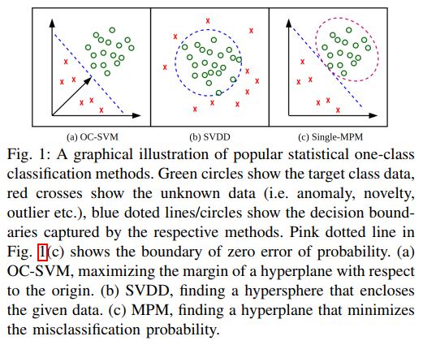
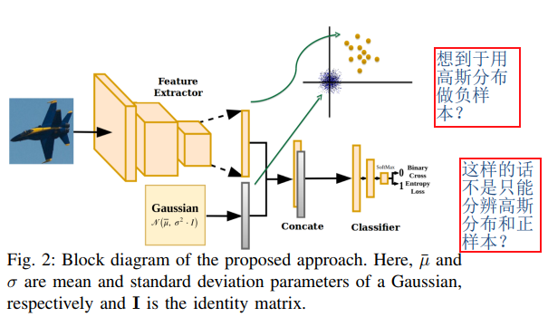

## One-Class Convolutional Neural Network
阅读笔记 by **luo13**  
2020-5-10  

这篇论文没有使用One-Class SVM的思想，而是直接用高斯分布模拟了原点数据，这样就可以使用交叉熵损失优化网络，虽然作者最后也做了将分类头换成SVM的实验，而且实验结果比本来的结构还好，但没有把实验细节说清错。疑惑的地方还是为什么原点数据可以代表异常数据呢？  

这篇文章的主要贡献点是将一分类问题转换成了二分类问题，使用高斯分布生成的数据模拟原点数据，但为什么可以这样做，作者并没有给出解释

