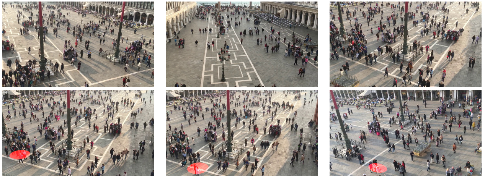
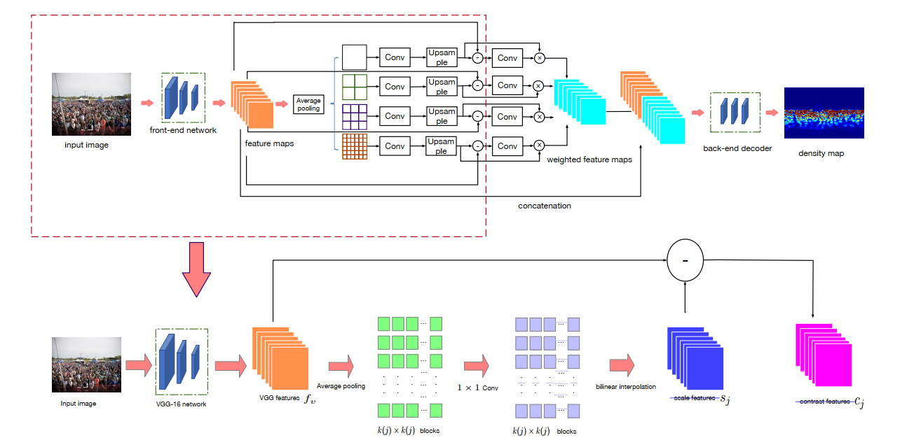
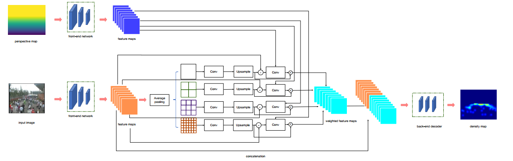
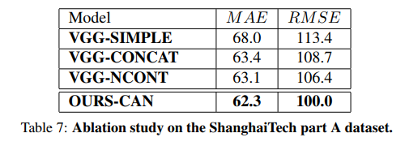
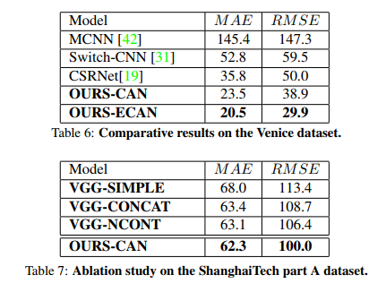

## Context-Aware Crowd Counting
Congested Scenes
阅读笔记 by **luo13**  
2020-5-2  

这篇文章提出了一个新的人群计数的网络结构。并且提出了一个新的有较大透视失真的数据集。  
文章贡献：  
1、将SPP结构融入到了人群计数框架当中。  
2、在SPP结构的基础上得到了每一个尺寸的权重图，相当于引入了一个注意力机制。  
3、提出了一个有较大透视失真且可以较为精准进行畸变校正的数据集。  

  
这是这篇文章提出的数据集中的一些图片例子，可以通过地面的线生成perspective map，但是具体的方法作者没有说。

  
网络的backbone采用了VGG的前十层，之后加了一个SPP结构，SPP结构得出的特征与SPP输入特征相见，得到了SPP相应分支关注的区域特征，再使用这一特定区域特征与SPP输出特征相乘得到权重图。直观上来讲就是，让每个分支自适应加强感兴趣区域的特征学习（SPP不同的分支对应了不同的感受野，也就能提取不同距离的人群特征）。得到的权重图按作者的解释就是全局信息与区域信息的不同点。  

  
因为WorldExpo’10与venice数据集都可以利用一定规则计算perspective map，所以作者又提出了一个网络结构将perspective map与原来的网络结构结合起来。

  
  
NCONT是指没有相减得到weight map，从消融实验可知，加入SPP的提升是最大的，然后加入contrast feature之后又有所提升，但是幅度较小。  

加入perspective map对劫夺也有所提升，特别是在透视较为严重的数据集上提升较大。  

思考：基于密度图的人群计数跟实例分割真的挺像，SPP也是实例分割中涨点较多的即插即用的模块。  
